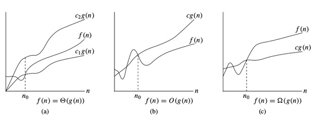
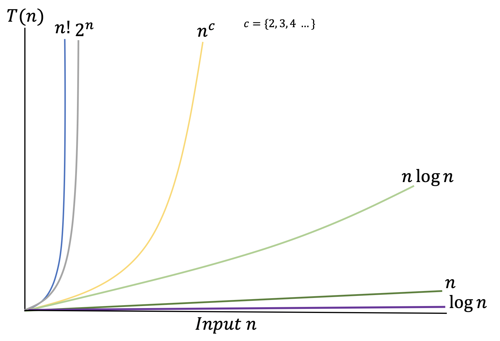

# Time and Space Complexity
For a given problem, there might be different ways to solve it. To find the better approach it is required to analyze the algorithms in terms of performance.\
Mostly Time and Space complexity is considered for performance analysis. Time complexity of an algorithm quantifies the time required by an algorithm to run as a function of the length of the input. \
Space complexity of an algorithm quantifies the amount of space or memory taken by an algorithm to run as a function of the length of the input.

***Order*** of growth is how the time of execution depends on the length of the input. Order of growth will help us to compute the running time with ease. We will ignore the lower order terms, since the lower order terms are relatively insignificant for large input. We use different notation to describe limiting behavior of a function.

-notation:
To denote asymptotic upper bound, we use -notation. For a given function , we denote by (pronounced “big-oh of g of n”) the set of functions:
 _there exist positive constants_ _c_  and  such that  for all 

-notation:
To denote asymptotic lower bound, we use -notation. For a given function , we denote by  (pronounced “big-omega of g of n”) the set of functions:

 _c_ and  such that  for all 

-notation:
To denote asymptotic lower bound, we use -notation. For a given function , we denote by  (pronounced “big-theta of g of n”) the set of functions:

  such that  for all 

**Linear-**:
Most optimal algorithms run in linear time. An easy way to identify this is to determine if you're accessing/visiting every input/node/item once and only once.  If you are, it is linear... it doesn't matter how many operations you're doing whether it's 1, 2, 3, or 4 lines of code you're executing per node.  Generally, you are still doing a constant amount of work per input.

**Constant-**:
A constant time algorithm have a running time independent of the input size. An algorithm is said to be constant time (also written as  time) if the value of  is bounded by a value that does not depend on the size of the input.

**Logarithmic-**:
An algorithm is said to take logarithmic time when . Since  and  are related by a constant multiplier, and such a multiplier is irrelevant to big-O classification, the standard usage for logarithmic-time algorithms is  regardless of the base of the logarithm appearing in the expression of T.
Logarithmic algorithms are often seen in trees.  It's best to think of "logarithmic" as the "height of the tree."  So, a binary search, for instance, often includes traversing down the height of a tree and can be considered logarithmic in time.  (Although, it may still be more accurate to say that for an unbalanced tree, the runtime is in the worst case linear.)  

**Quasilinear**-:  
An algorithm is said to run in quasilinear time (also referred to as log-linear time) if  for some positive constant *k*; linearithmic time is the case .
Algorithms which run in quasilinear time include:
* In-place merge sort, 
* Quicksort, , in its randomized version, has a running time that is  in expectation on the worst-case input. Its non-randomized version has an  running time only when considering average case complexity.
* Heapsort, , merge sort, introsort, binary tree sort, smoothsort, patience sorting, etc. in the worst case
* Fast Fourier transforms, 
* Monge array calculation, 

**Quadratic or Cubic** -  or :\
An algorithm is said to be quadratic time if , and for cubic . Brute force algorithms often takes quadratic or cubic time.

**Polynomial** - :\
An algorithm is said to be of polynomial time if its running time is upper bounded by a polynomial expression in the size of the input for the algorithm, i.e.,  for some positive constant *k*.

**Exponential time**:\
An algorithm is said to be exponential time, if  is upper bounded by , where  is some polynomial in *n*. More formally, an algorithm is exponential time if  is bounded by  for some constant *k*. 
Sometimes, exponential time is used to refer to algorithms that have , where the exponent is at most a linear function of n. 

**Factorial time**:\
These algorithms are the slowest and don't show up that often.  You might see this in combinatorial problems, or like a "traveling salesman" problem where given n nodes, you need to find the optimal path from start to finish.\
In your first iteration, you have a selection of *n* cities to visit, then *n-1* cities, then *n-2* cities, *n-3* cities, etc., until you reach the last city. That runtime is .

