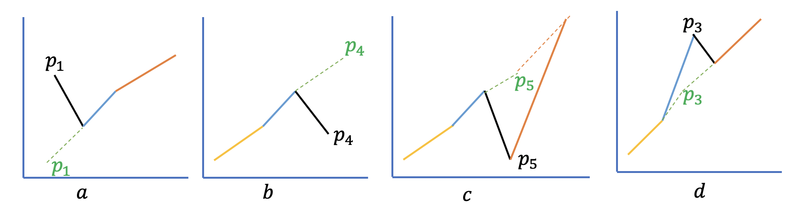

# Test Problems
- [Test Problems](#test-problems)
    - [Validate Binary Search Tree](#validate-binary-search-tree)
    - [Ransom Note Problem](#ransom-note-problem)
    - [Add two numbers represented in link list](#add-two-numbers-represented-in-link-list)
    - [Find if sum of two exits in a list](#find-if-sum-of-two-exits-in-a-list)
    - [Find first and last index of a number in a sorted array](#find-first-and-last-index-of-a-number-in-a-sorted-array)
    - [Permutation](#permutation)
    - [Sort a list with 3 unique numbers](#sort-a-list-with-3-unique-numbers)
    - [Find longest non-repeating substring](#find-longest-non-repeating-substring)
    - [Queue Reconstruction By Height](#queue-reconstruction-by-height)
    - [Find a non duplicate number in an array](#find-a-non-duplicate-number-in-an-array)
    - [Reverse a link list](#reverse-a-link-list)
    - [Maximum in a stack](#maximum-in-a-stack)
    - [Find Pythagorean Triplet](#find-pythagorean-triplet)
    - [Course Pre-requisites](#course-pre-requisites)
    - [Push Dominoes](#push-dominoes)
    - [Add subtract calculator](#add-subtract-calculator)
    - [Product of Array except self](#product-of-array-except-self)
    - [Non Decreasing Array](#non-decreasing-array)
    - [Unique Number of Occurrences](#unique-number-of-occurrences)
    - [Find word in grid](#find-word-in-grid)
    - [Check if a given string is Palindrome](#check-if-a-given-string-is-palindrome)
    - [Boundary of Binary Tree](#boundary-of-binary-tree)
    - [Binary Tree Right Side View](#binary-tree-right-side-view)
    - [Least Recently Used cache](#least-recently-used-cache)
    - [Find if linked list has cycle](#find-if-linked-list-has-cycle)
    - [Validate Parentheses in a expression](#validate-parentheses-in-a-expression)
    - [Letter Combinations of a Phone Number](#letter-combinations-of-a-phone-number)
    - [Find first bad version](#find-first-bad-version)
    - [Find Max Consecutive Ones](#find-max-consecutive-ones)
    - [Find Max Consecutive Ones with K changes](#find-max-consecutive-ones-with-k-changes)
    - [Find Longest Continuous Subarray With Absolute Diff Less Than or Equal to Limit](#find-longest-continuous-subarray-with-absolute-diff-less-than-or-equal-to-limit)
    - [Find Top K Frequent Elements](#find-top-k-frequent-elements)
    - [Get container with most water](#get-container-with-most-water)
    - [Find if one can attend all the meetings](#find-if-one-can-attend-all-the-meetings)
    - [Find minimum meeting room required](#find-minimum-meeting-room-required)
    - [Kth Largest Element in an Array](#kth-largest-element-in-an-array)
    - [Merge two sorted linked lists](#merge-two-sorted-linked-lists)
    - [Rotate List by K](#rotate-list-by-k)
    - [Search in Rotated Sorted Array](#search-in-rotated-sorted-array)
    - [Serialize and Deserialize Binary Tree](#serialize-and-deserialize-binary-tree)
    - [Boundary of Binary Tree](#boundary-of-binary-tree)
    - [Count Islands](#count-islands)
    - [Cameras in Binary Tree](#cameras-in-binary-tree)
    - [Count Univalue Subtrees](#count-univalue-subtrees)
    - [Sum of 3 number](#sum-of-3-number)
    - [Insert Delete GetRandom in constant time](#insert-delete-getrandom-in-constant-time)
    - [Design In-Memory File System](#design-in-memory-file-system)
    - [Add numbers represented in string](#add-numbers-represented-in-string)
    - [Verify alien word ordering](#verify-alien-word-ordering)
    - [Binary search tree iterator](#binary-search-tree-iterator)
    - [Binary search tree validation](#binary-search-tree-validation)
    - [Find first non-repeating character in a string](#find-first-non-repeating-character-in-a-string)
    - [Compress a given string](#compress-a-given-string)
    - [Format phone number](#format-phone-number)
    - [Find diameter of binary tree](#find-diameter-of-binary-tree)
    - [Group anagrams](#group-anagrams)
    - [Binary Tree Level Order Traversal](#binary-tree-level-order-traversal)
    - [Best Time to Buy and Sell](#best-time-to-buy-and-sell)
    - [Binary Tree Zigzag Level Order Traversal](#binary-tree-zigzag-level-order-traversal)
    - [Combination Sum](#combination-sum)
    - [Combination Sum 2](#combination-sum-2)
    - [Combination Sum 3](#combination-sum-3)
    - [Decode String](#decode-string)
    - [Decode Ways](#decode-ways)
    - [Copy List with Random Pointer](#copy-list-with-random-pointer)
    - [Divide Array in Sets of K Consecutive Numbers](#divide-array-in-sets-of-k-consecutive-numbers)
    - [Count connected component](#count-connected-component)
    - [Happy Number](#happy-number)
    - [Intersection of two linked lists](#intersection-of-two-linked-lists)
    - [Find k closest points to origin](#find-k-closest-points-to-origin)
    - [Merge two sorted lists](#merge-two-sorted-lists)
    - [Merge k Sorted Lists](#merge-k-sorted-lists)
    - [Merge Sorted Array](#merge-sorted-array)
    
    
### Validate Binary Search Tree
*Problem:*\
Given a binary tree, check if the tree is a valid binary search tree(BST).

The Binary Search Tree has the following properties: 
* Each node is represented by a Key, numeric type
* Each node may be at max two child, left and right
* The left subtree of a node(A) contains the nodes which are less than parent node(A)
* The right subtree of a node(A) contains the nodes which are greater than parent node(A)
* Both left and right subtrees must be binary search tree

**Example:**
```
a)          8 
           / \
          6  10
         / \   
        1   5

b)           8 
            / \
           6   10
               / \
              7  12

c)           8 
            / \
           6   10
          / \   
         4   9  

d)          8 
          /   \
         6     10
        / \    / \
       3   7  9  12

e)           8 
            / \
           6   10
          / \   
         4   7  

```

In the above trees a) b) c) are invalid BST. 

Tree notation: `[L N R]`; `L` - Left child, `R` - Right Child, `N` - Parent node

Tree *a)* is invalid BST because left subtree of node `8` *[1 6 5]* is not binary search tree as right child `5` of node `6` is not greater than 6.

Tree *b)* is invalid BST. Right subtree, *[7 10 12]*, of node `8` is BST but all the nodes in right subtree of node `8` is not greater than `8`. Node `7`, left child of node `10` is less than node `8`.

Tree *c)* is invalid BST because all the nodes in left subtree of node `8` is not less than 8. In *[4 6 9]* is a valid BST but node `9` greater than node `8`, which implies that all the nodes in left subtree of node `8` is not smaller than `8`. 

Tree *d)* and *e)* is valid BST.

**Solution:**
For given tree where root node is *R*, 
1. check if left subtree is BST or not, and maintain a range of node values, node with lowest key and node with highest key.
2. check if the right subtree is BST or not? and maintain the same range, lowest and highest keys.
3. if highest key in the range from left subtree is less than the node *R*, and if the lowest key in the range from right subtree is greater than the node *R* then tree is BST.

**Time Complexity:**
In the above approach we are evaluating each node exactly once. The approach is linear time. So the time complexity will be __O(n)__.

**Space Complexity:**
We have to solve this in recursive way, where we will have a validate function where we pass the node. So the space complexity will be based on call-stack for recursive calls. 
Space complexity of recursion process is the depth of the recursion. For binary tree the recursion depth is height of the tree. 
In a balanced binary tree the height of the tree is __log_2(n)__. In worse case we have to go till the lowest level and evaluate each node, then the complexity will be __O(n)__.

[Implementation](./problems/validate_binary_search_tree.py)


### Ransom Note Problem
**Problem**\
Given an arbitrary ransom note string and another string containing letters from all the magazines, write a function that will return true if the ransom note can be constructed from the magazines; otherwise, it will return false.\
Each letter in the magazine string can only be used once in your ransom note.Each letter in the magazine string can only be used once in your ransom note.

Consider the ransom note contains only letters and lowercase. 

**Example**
```
(Ransom Note, Magazine)
('abadc', 'aazzbccdy') - True
('zabd', 'aazzbccdy') - True
('aebe', 'aazebccdy') - False
('aebei', 'aazebecdy') - False
```
**Solutions:**\
Brute Force Approach:\
Take each letter from ransom note string and search in the magazine, if that exists. If exists then update the magazine by removing the letter. In this case the complexity will be
 where *m* is the number of letters in ransom note and *n* is the total number of letters in the magazine. So the complexity will be around .

**Better Approach:**\
We have to read all the characters in the ransom note, so the complexity is . Now we can optimize the searching in magazine. Store the magazine such a way that a letter can be found at constant time. To do that we can use hash map, scan the magazine once and store the letters and number of occurrence in the hash map.
For every letter in ransom note we check the letter in the hash map:\
    - if not found, then return false\
    - if found, then deduct number of occurrence. If number of occurrence is less than 0 then return false otherwise true.\
For `('abadc', 'aazzbccdy')`
Hash Map will be 
```
{
    a -> 2,
    z -> 2
    b -> 1,
    c -> 2,
    d -> 1,
    y -> 1
}
```
After reading the first letter a:
```
{
    a -> 1,
    z -> 2
    b -> 1,
    c -> 2,
    d -> 1,
    y -> 1
}
```
After reading the 2nd letter :b
```
{
    a -> 1,
    z -> 2
    b -> 0,
    c -> 2,
    d -> 1,
    y -> 1
}
```
After reading the 3rd letter :a
```
{
    a -> 0,
    z -> 2
    b -> 0,
    c -> 2,
    d -> 1,
    y -> 1
}
```
Like these after matching all the letters the magazine will be: 
```
{
    a -> 0,
    z -> 2
    b -> 0,
    c -> 1,
    d -> 0,
    y -> 1
}
```
**Time Complexity:**
 for creating the hash map and  for iterating over the ransom note.\
So the complexity will be +

**Space Complexity:**
Space complexity will depend on the hash map. If there are 26 characters in magazine then the space complexity will be 

[Implementation](./problems/ransom_note.py)

### Add two numbers represented in link list
Given two link list where each link list represents a number in reverse order. Write a function that takes two numbers in reverse order and represented in link list and returns sum of the numbers represented in link list.

**Example:**
```
 342    -> Link List: 2 -> 4 -> 3
+465    -> Link List: 5 -> 6 -> 4
-----               ----------------
 807                  7 -> 0 -> 8  

```
**Time Complexity:**\
**Space Complexity:**

[Implementation](./problems/add_two_number_in_link_list.py)

### Find if sum of two exits in a list

*Problem:*\
Given a list/array of numbers and a target number. Write a function that returns true if sum of any two number in the list is equal to the target number.

*Example*
```
ar = [2,1,9,5,7,2,4] target number = 5
1 + 4 = 5
The result: true
```

*Solution*
The brute force approach is to check any combination of two number and check their sum with target number.
For the example above: 
```
ar = [2,1,9,5,7,2,4] target number = 5
pick 2
    check sum(2,1) = 3 != 5
    check sum(2,9) = 11 != 5
    check sum(2,5) = 7 != 5
    check sum(2,7) = 9 != 5
    check sum(2,2) = 4 != 5
    check sum(2,4) = 6 != 5

pick 1
    check sum(1,9) = 10 != 5
    check sum(1,5) = 6 != 5
    check sum(1,7) = 8 != 5
    check sum(1,2) = 3 != 5
    check sum(1,4) = 5 = 5  -> RETURN TRUE
    
```

For this approach the time complexity is . For each number in the array you are comparing all the remaining numbers in the list. If you have n numbers then the complexity is . The space complexity is 0 as we don't need any more space.
```python
for n1 in ar:
    for n2 in ar:
        if n1 == n2:
            continue
        if n1 + n2 == target:
            return true
```
Linear solution:
Preprocess the numbers in the list/array and keep in a hash map with the index. And for each number we subtract form the target and check if the difference is in the hash map.

**Time Complexity**\
Its a linear approach as we check each number once only. So the time complexity is .

**Space Complexity**\
We need the space for the hash map, and the size of the hash map will be number of elements in the array. So the space complexity will be  .

[Implementation - Brute-force](./problems/sum_of_two_numbers_brute_force.py)
[Implementation](./problems/sum_off_two_numbers.py)
[Implementation - Java](./java/src/com/ds/practice/SumOftwo/SumOfTwo.java)

### Find first and last index of a number in a sorted array
**Problem:**\
Given a array/list of sorted number and a target number. Write a function to find the first and last index of the target number in the array.

**Solution:**\
A linear time solution will be read each number in the array and check if current number is the target number. On first occurrence add the index as first index and on the last occurrence add the index as last index. 
First and last occurrence can be determined by: 
* first: if the last number is less than the target number and current number is target number.
* last: if the next number is greater than the target number or null/end of array and current number is the target number.   

The time complexity for this approach will be  and space complexity will be constant as we need to keep track of low and high index.

We can do better. As the array is sorted we can use binary search which will be efficient as we will be searching on half of the array and sub arrays.
So the idea is to use two binary search, one to find the first index of the target number and the second search for the last index.
**Time Complexity**\
The time complexity will be `log n` for binary search. So for two binary search, the time complexity will be `O(log n) + O(log n) = O(log n)`

**Space Complexity**\
Space complexity will depend on implementation process. For recursion, the complexity will depend on the recursion depth/call stack. 

[Implementation](./problems/sum_off_two_numbers.py)

### Permutation
**Problem:**\
Given a array of random numbers, find all the permutations.

Example: 
```
array = [1, 2, 3]
Permutations:
[1, 2, 3]
[1, 3, 2]
[2, 1, 3]
[2, 3, 1]
[3, 1, 2]
[3, 2, 1]
```

**Solution**\
In iterative approach we can solve like this: pick the first number for position 1 from 3 numbers(), then pick number for position 2 from remaining 2 number, then pick the remaining number for position 3.
The time complexity is `n!`. `n!=n x (n-1) x (n-2)`

```
                    *
                 /  |  \ 
                1   2    3
               /\   /\   /\
              2  3 1  3 2  1
              |  | |  | |  |
              3  2 3  1 1  2
```

### Sort a list with 3 unique numbers
**Problem:**\
Given a array with 3 unique numbers, sort that list.

Examples:
```
ar = [2, 9, 5, 2, 9, 2, 5]
Sorted array: [2, 2, 2, 5, 5, 9, 9]
```

Solution #1: \
We can just sort it using any sorting algorithm. Quick sort or Merge sort with complexity `n log n`.

Solution #2: \
We can use a data structure to store number of appearance for each number in the list. \
Like for the above list 2 appeared 3 times, 5 and 9 appeared twice. Then sort three unique numbers, that \
will be constant time. We can use a hash map to store the counts. Then reconstruct the list \
from the hash map. This is a linear approach and single pass. As we are using a hash map the \
space complexity will be linear.

Solution #3: \
Solution #2 was good but it uses additional space. Lets try to do the sorting in place \
without using any data structure.

So the idea is to separate two numbers/types of numbers in two end of a linear line/list/array. \
Then we will have the 3rd type in the middle. For this approach we can use two pointers, one will \
point the max index of lowest number in the list and another pointer will point the max index of \
 highest number in the list. 

**Time Complexity**\
The approach is linear so the time complexity will be `n`.

**Space Complexity**\
The sorting will be done in place, no additional space is required.
 
[Implementation](./problems/sort_list_with_3_unique_number.py)


### Find longest non-repeating substring
**Problem:**\
Given a string, find the length of the longest substring without repeating characters.

Examples:
```
String: abrkaabcdefghijjxxx
Length: 10
```

Solution #1: \
Iterative approach: Find create a list of all possible substrings from the string. Which will require 
n(n+1)/2. Then check all the substrings with unique characters, linear computation `O(n)`. So the complexity will be `O(n^3)`.

Solution #2: \
We can use two pointer, one with start position of non repeating sub-string and another one for end position.
When we see find a duplicate character then we move to next start index. The approach is called 
*sliding window*. Time complexity for this approach is `O(n^2)`

```
FIND-MAX-LENGTH(A)
1  size ← A:length
2  result ← 0
3  for i ← 0 to size
4    visited[0 to size] ← [false]
5      for j ← i to size
6        if visited[A[j]] == true 
7          break;
8        else
9          result ← MAX(result, j - i + 1)
10         visited[A[j]] ← true  
11     visited[A[i]] ← false
12 return result

```
Solution #3: \
Try solving the problem in linear time. We will use additional space for this approach.
We will use a hash map data structure to store last seen position of a character. Start pointer/flag 
is set to -1 and end to the first char. Then for each char we will update the start when a duplicate if found, other wise keep increasing end pointer/flag.
For each char we calculate difference between start and end and get maximum of previous result/max-length and current result/max-length.


**Time Complexity**\
The approach is linear so the time complexity will be `n`.

**Space Complexity**\
As we are using a hash map and the size of the hash map will be at max the number of characters in the string. So the space complexity will be `O(n)`.
 
[Implementation](./problems/find_longest_non-repeating_substring.py)
[Implementation](./java/src/com/ds/practice/LongestNonRepeatingSubstring/NonRepeatingSubstring.java)


### Queue Reconstruction By Height
**Problem:**\
Consider a random list of people standing in a queue. If each person is described by a pair of integers `(h, k)`, 
where `h` is the height and `k` is the number of people in front of him, who have a height greater than or equal to `h`. The problem is to define one method to reconstruct the queue.

**Example:**
```
Input:  [[7,0], [4,4], [7,1], [5,0], [6,1], [5,2]]
Output: [[5,0], [7,0], [5,2], [6,1], [4,4], [7,1]]
```
**Solution:** \
A key thing is that a person with higher height won't see the people ahead with lower height than him. 
So we can place the higher height people in a new list and then insert second highest peoples and repeat.
For example:
First place [7,0] and [7,1]
```
[[7,0]  [7,1]]
```
place [6, 1]
```
[[7,0] [6, 1] [7,1]]
```
place [5, 0] [5, 2]
```
[[5, 0] [7,0] [5, 2] [6, 1] [7,1]]
```
place [4, 4]
```
[[5, 0] [7,0] [5, 2] [6, 1] [4, 4] [7,1]]
```

First we need to sort the list using a custom comparator, sort by height then if height is same then sort by person ahead of him. Then check each person and sort them in to a array and return the array.

**Time Complexity**\
Sorting with a good sorting algorithm will require `O(n log n)`, and going through each person will require `O(n)`. \
So time complexity is `O(n log n) + O(n) = O(n log n)`

**Space Complexity**\
We are creating a new list, so space complexity is `O(n)`

[Implementation](./problems/queue_reconstruction.py)


### Find a non duplicate number in an array
**Problem:**\
Given an array of *n* integers, every number in it appears twice expect for one. The problem is to find the one with single occurrence.

Example:
```
Input: [4, 8, 3, 5. 4, 2, 5, 3, 8]
Output: 2

Input: [2, 0, 9, 2. 5, 9, 0]
Output: 5
```

**Solution #1:** \
One approach is to read each number in the list once and store appearance count in a hash map. And then iterate each element in the hash map, the number will single appearance will be the result.
Time complexity will be: `O(n)` for reading each element in the list to create hash map, then `O(n)` for iterating over the hash map. Total complexity is `O(n) + O(n) = O(n)`, linear time. As we have used hash map that will require linear space, `O(n)`.

**Solution #2:** \
Lets try to optimize the solution. We can optimize time complexity as its already linear time. But we can avoid the hash map to remove space complexity.
The key idea is to use `XOR` operation. In `XOR` if the bits are same then results 0 and 1 if bits are opposite.\
`5 XOR 5 = 0 | 101 XOR 101 = 000`\
`5 XOR 2 = 7 | 101 XOR 010 = 111`\
`7 XOR 5 = 2 | 111 XOR 101 = 010`

**Time Complexity**\
`O(n)`

**Space Complexity**\
No additional space is required.

[Implementation](./problems/find_non_duplicate_number.py)

### Reverse a link list
**Problem**\
Given a singly link list. Write a function to reverse the link list

Example
```
Input: 5 -> 8 -> 4 -> 9 -> 0 -> 3
Output: 3 -> 0 -> 9 -> 4 -> 8 -> 5
```

**Solution 1#**\
Visit each node from beginning and push the nodes values in a stack. Then pop values from the stack and create a new link list and keep appending. 
Stack is last-in-first-out(LIFO), reverse the link list. The time complexity is `O(n)` for visiting each node in the link list, and `O(n)` for accessing each element in the stack. So time complexity is `O(n) + O(n)= O(n)`. And space complexity is linear for stack, `O(n)`.

**Solution 2#**\
Time complexity of previous solution is linear, and thats the lower bound as we have to visit each node at-least once. But we will try to do it in one pass by visiting each node exactly once. Also we can optimize space.
The idea is the reverse the links for each node or swap the nodes.

**Time Complexity**\
`O(n)`

**Space Complexity**\
No additional space is required.
[Implementation](./problems/reverse_link_list.py)


### Maximum in a stack
**Problem**\
Given a stack of integers. The task is to design a special stack such that maximum element can be found in `O(1)` time.

Example:
```
Stack: [1, 4, 2, 5, 4]
Max: 5
Pop: 4
Max: 5
Pop: 5
Max: 4
```

**Solution 1#**\
One approach is to go over all the elements in stack and get the maximum, brute-force approach. Time complexity will be `O(n)` and constant space complexity, `O(1)`. Lets try to optimize the time complexity

**Solution 2#**\
In this solution we will use additional space or data structure to hold maximum for each sub stack. We can consider another stack with max.

For example
```
push(1)
Stack: [1]
Max-Stack: [1]

push(2)
Stack: [2, 1]
Max-Stack: [2, 1]

push(1)
Stack: [1, 2, 1]
Max-Stack: [2, 2, 1]

push(3)
Stack: [3, 1, 2, 1]
Max-Stack: [3, 2, 2, 1]  

max(): 3

pop(): 3
max(): 2
Stack: [1, 2, 1]
Max-Stack: [2, 2, 1]
```

**Time Complexity**\
`O(n)`

**Space Complexity**\
`O(n)`

[Implementation](./problems/maximum_in_stack.py)


### Find Pythagorean Triplet
**Problem**\
Given an array of integers, write a function that returns true if there is a triplet *(a, b, c)* that satisfies `a^2+b^2=c^2`.

**Solution #1**\
We can loop over the array three times to get all possible combination of the triplets.
```python
for a in ar
    for b in ar
        for c in ar
            if a^2 + b^2 == c^2
                return true 
```
Time complexity for this brute-force approach is `O(n^3)` and constant space complexity `O(1)`.

**Solution #2**\
We can optimize a little by solving the problem in `O(n^2)`. The idea is to use set or hash map data structure to store squared value.
```
sq <-[n ^ 2]
for a in ar
    for b in ar
        if a^2 + b^2 in sq
            return true
```

**Time Complexity**\
`O(n^2)`

**Space Complexity**\
`O(n)`

[Implementation](./problems/maximum_in_stack.py)

### Course Pre-requisites
Give a list of courses and pre-requisites, determine if courses can be completed.

**Example:**
```
1. Number of courses: 2, Pre-requisites: [[1,0]]
2. Number of courses: 2, Pre-requisites: [[1,0], [0,1]]
```
In example `1.` there are two courses and course `1` has a pre-requisite course `0`. In this case pre-requisites are valid.
But in example `2.` number of coursed are 2, and course `1` has pre-requisite of course `0` and course `0` has pre-requisite of course `1`.
So you can't take course `1` without completing course `0`, and can't take course `0` without completing course `1`. So the one can't complete the courses.

**Solution:**\
We can create a directed graph, where the courses represent the nodes and edges represents the edge.
If there is any cycle in the graph then the courses can't be completed. So we reduced the problem 
to graph problem and the target is to find a cycle in the graph. If there is no cycle then
course pre-requisites set correctly and courses can be completed.

We can create a data structure such that each node has a list of edges where it goes to.
```
| 0 [1]
| 1 [0, 2, 3]
| 2 [3]
| 3 []

```

**Time Complexity**\
`O(n)`

**Space Complexity**\
`O(n)`

[Implementation](./problems/course_prerequisite.py)

### Push Dominoes
There are *n* dominoes placed horizontally. Each domino is placed vertically upright.
Then push some of the dominoes either to the left or to the right. Each domino that is falling to the left pushes the adjacent domino on the left and dominoes falling to the right push their adjacent dominoes standing on the right.
A vertical domino has dominoes falling on it from both sides, it stays still due to the balance of the forces.

Given a string *S* representing the initial state. *S[i] = 'L'*, if the *i-th* domino has been pushed to the left; *S[i] = 'R'*, if the *i-th* domino has been pushed to the right; *S[i] = '.'*, if the *i-th* domino has not been pushed.
Return a string representing the final state. 

**Example:**\
Input: ".L.R...LR..L.."\
Output: "LL.RR.LLRRLL.."

**Solution:**\
We can use two passes. In first pass we will add impacts of Left push then in next pass we will add impacts of right push. 
Impacts of each push will be represented by numbers. For left push we will use positive number and at each domino the number will reduce. 
For right push, we will use negative number, and at each domino the number will increment. 

Then we sum both of the impacts. The domino with with positive impact sum will be angled towards left and negative impact sume will angle towards right. And,
domino with impact sum 0 stands string vertically.  

Input: .L.R...LLR.R....LR..
Number of domino: 20
Max value for Left push: 20
Mad value for Right push: -20

First Pass:\
.L.R...LLR.R....LR..\
-19 -20 0  0 -17 -18 -19 -20 -20  0  0  0 -16 -17 -18 -19 -20  0  0 0\

Second Pass:\
.L.R...LLR.R....LR..\
 0   0  0 20 +19 +18 +17   0   0 20 19 20 +19 +18 +17 +16   0 20 19 17
 
Sum:\
  -19 -20 0  0 -17 -18 -19 -20 -20  0  0  0 -16 -17 -18 -19 -20  0  0 0\
   0   0  0 20 +19 +18 +17   0   0 20 19 20 +19 +18 +17 +16   0 20 19 17\
= -19 -20 0 20 +2   0  -2  -20 -20 20 19 20 +3  +1  -1  -3  -20 20 19 17\
 L   L  . R  R   .   L    L   L   R  R  R  R   R   L   L   L  R   R  R
 
Output: LL.RR.LLLRRRRRLLLRRR

**Time Complexity**\
Here we are doing two pass, each of them are linear. So, the time complexity is *O(2n)*=*O(n)*. It's linear.

**Space Complexity**\
We need to store the push effect numbers for each pass, space complexity will be also *O(2n)*=*O(n)*.

[Implementation](./problems/push_dominoes.py)


### Add subtract calculator
Problem:
Given a math expression in string that contains plus, minus operation, parentheses and digits. The porblem is to parse the string, evaluate the expression and return result.

**Solution:**\
We need to read each character one at a time and process it. Process will be different for operators, numbers and parentheses. 
We need to remember previous operator. 

Here we will use stack. First we will do reverse of the expression. Then read each character from the expression.
We will form operand using the digits and push to stack if there is a non-digit character.
We will push everything in stack except '('. For a expression, 
```
Expression: 5 + (12 - 3) + 1
Reverse: 1 + )3 - 21( + 5
1 - update operand
' ' - do nothing
+ - push operand and sign to stack, and reset operand | stack = [+, 1]
) - push to stack | stack = [), + 1]
3 - set operand to 3
' ' - do nothing
- - push operand and sign to stack, and reset operand | [-, 3, ), + 1]
' ' - do nothing
2 - set operand to 2
1 - update operand to 10+2 = 12
( - push operand to stack.This is end of an sub-expression, now evaluate the expression in stack until ')'
    stack = [12, -, 3, ), + 1]
    12 - 3 = 9
    result is 9, now remove ')' from stack and push result in stack.
    stack = [9, +, 1]
```

Finally, evaluate the remaining elements in the stack.

**Time Complexity**\
As we are reading each character once only, the time complexity is *O(n)*.
 
**Space Complexity**\
As we are using stack, so space complexity will be *O(n)* 


[Implementation](./problems/calculator.py)


### Product of Array except self
Given an array *nums* of *n* integers where *n > 1*,  return an array output such that *output[i]* is equal to the product of all the elements of nums except *nums[i]*.
For example:\
Input array is [4, 5, 9, 3]\
Output should be [135, 108, 60, 180]\

**Solution:**\
We can use extra space to store product of all the elements in the left except current one in one array. 
Similarly, store product of all the elements in right except current in another array. Then for each position/item we 
multiply product of left array and product of right array. 

**Time Complexity**\
There are two loops, the complexity is *O(2n)* = *O(n)*.

**Space Complexity**\
As we are using three arrays, the space complexity is *O(3n)=O(n)*

[Implementation](./problems/product_of_array_except_self.py)

### Non Decreasing Array
Given an array *nums* with *n* integers, your task is to check if it could become non-decreasing by modifying at most *1* element.

We define an array is non-decreasing if *nums[i] <= nums[i + 1]* holds for every *i (0-based)* such that *(0 <= i <= n - 2)*.\\
```
Input: [5, 2, 4]
Output: True
change 5 to 1, [1, 2, 4]

Input: [3, 2, 5, 4]
Output: False
There are two downwards scenerio, 3 to 2, 5 to 4. Its posible to fix only one, not both. 
```


**Solution:**\
Here, key points are: `non-decreasing`, `modify at most once`. Non-decreasing means equal or increasing. Let's discard a obvious case: if there are more than one scenario where the numbers are decreasing then return `False`. Because we are allowed to fix only one such occurrence.
So we have to find decreasing pattern in the array, if there is none then return true. Decreasing pattern will be like this: 
```
array[i] > array[i+1] 
or
array[i-1] > array[i]
```

Let's point some decreasing cases and how to fix them:

 

In *a)* if start index of decreasing line is the first  element then we can easily plot the stating point in reference to the next.
For example: *[5, 3, 6]*, so we just need to move first element less than or equal to the next element, that is [2, 3, 6]

In *b)*, if start index of decreasing line is the last element then we can easily plot the last point in reference to the previous point.
For example: *[2, 5, 3]*, update last point equal to second last point or more than that. *[2, 5, 6]*

If start index of decreasing line is in between first and last element then there could be two cases:
In *c)*, if *[index + 2] >= [index]* then we can fix this case by moving *[index+1]* up equal to *[index + 2]*.
in *d)*, if *[index + 1] >= [index - 1]* then we can fix this case by moving *[index]* down equal to *[index-1]* or *[index+1]*

**Time Complexity**\
This approach is single pass, so time complexity is *O(n)*.

**Space Complexity**\
Constant space

[Implementation](./problems/non-decreasing-array.py)

### Unique Number of Occurrences
Given an array of integers, write a function that returns *true* if and only if the number of occurrences of each value in the array is unique.

For example:
Input: *[2,5,1,2,5,2]*\
Output: *True*\
Occurrence: *1* 1 time, *2* 3 times and *5* 2 times, [1,3,2]

Input: *[2,5,1,2,5,2,3]*\
Output: *False*\
In this example *1* and *3*, both numbers appeared once in the array. 
 
**Solution:**\
We can do this in two pass. In first pass we store occurrences in a hash map. 
In the second pass we loop over the occurrence numbers and check if there is any
duplicate.

**Time Complexity**\
Time complexity is *O(n)*.

**Space Complexity**\
As the solution uses hash map, so the space complexity is *O(n)*

[Implementation](./problems/unique_number_of_occurrences.py)


### Find word in grid
Given a 2D matrix containing letter and a word, task is to find if the word exists in the grid.\
The word can be constructed from letters of sequentially adjacent cell, where "adjacent" cells are those horizontally or vertically neighboring. The same letter cell may not be used more than once.

Example:
```
2D matrix
[
  ['A','B','D','T'],
  ['C','D','E','S'],
  ['C','G','F','H']
]

Input: ABDEF
Output: True

Input: BDCCGF
Output: True

Input: TSEDCGF
Output: False

Input: BDCCGD
Output: False
```

**Solution**
Diagonal move is not allowed. So available moves are top, bottom, left, right of current postion. 
We will start searching, by row. In a row, if a matching character is found in a column then we check top, bottom, left, right of that position if matches next character. 
Recursively we do the same thing. 
Base case for returning true is when all the characters are found. If a character is matched then we explore all possible moves one by one unless false is returned.
Edge cases are:
Return False if 
*  row, column index is less than 0, or greater than the matrix size.
*  if character at position [row][col] is not equal

**Time Complexity**\
Time complexity is *O(N*3^L)*, where N is the number of cells in the matrix, L is the number of characters in the word.

**Space Complexity**\
*O(L)*, *L* is the length of the word to match.

[Implementation](./java/src/com/ds/practice/wordsearch/SearchWord.java)

### Check if a given string is Palindrome
Given a string, find the longest palindromic substring in the string.

**Bruteforce solution:** Time complexity is *O(n^3)*, constant space.
[Implementation](./java/src/com/ds/practice/LongestPalindrome/LongestPalindromeBF.java)

**Dynamic Programming:** Time complexity is *O(n^2)*, Space complexity is *O(n^2)*.
[Implementation](./java/src/com/ds/practice/LongestPalindrome/LongestPalindromeDP.java)

### Boundary of Binary Tree
Given a binary tree, return the values of its boundary in anti-clockwise direction starting from root. Boundary includes left boundary, leaves, and right boundary in order without duplicate nodes.  (The values of the nodes may still be duplicates.)

Left boundary is defined as the path from root to the left-most node. Right boundary is defined as the path from root to the right-most node. If the root doesn't have left subtree or right subtree, then the root itself is left boundary or right boundary. Note this definition only applies to the input binary tree, and not applies to any subtrees.

The left-most node is defined as a leaf node you could reach when you always firstly travel to the left subtree if exists. If not, travel to the right subtree. Repeat until you reach a leaf node.

The right-most node is also defined by the same way with left and right exchanged.

**Example 1**
```
Input:
  2
   \
    5
   / \
  6   7

Ouput:
[2, 5, 6, 7]

Explanation:
The root doesn't have left subtree, so the root itself is left boundary.
The leaves are node 3 and 4.
The right boundary are node 1,2,4. Note the anti-clockwise direction means you should output reversed right boundary.
So order them in anti-clockwise without duplicates and we have [1,3,4,2].
```

**Example 2**
```


Input:
    ____1_____
   /          \
  2            3
 / \          /
4   5        6
   / \      / \
  7   8    9  10

Ouput:
[1,2,4,7,8,9,10,6,3]

Explanation:
The left boundary are node 1,2,4. (4 is the left-most node according to definition)
The leaves are node 4,7,8,9,10.
The right boundary are node 1,3,6,10. (10 is the right-most node).
So order them in anti-clockwise without duplicate nodes we have [1,2,4,7,8,9,10,6,3].
```

**Solution**:
So we can divide the boundary in to left boundary, leaf nodes and right boundary.

*Left boundary* consists of nodes which are left outer most in the left sub-tree. If left sub-tree is null 
then it will consider left outer most node in the right sub-tree.

*Leaf* nodes consist of nodes which doesn't have left and right child. 
 
*Right boundary* consists of the nodes which are right outer most in the right sub-tree and if right sub-tree is null
then it will consider the right outer most node in the left sub-tree.

```
Step 1: If root node is not null add the node to result.
Step 2: Find left boundary
        a) Start traversing the left subtree of the root
        b) Add curreent node to result if current node is not leaf node 
        c) Set current node to left subtree of current node
        d) If left subtree is null then set current node to right subtree of current node
Step 3: Find leaves
        a) Starting from the root node do a depth first search(in-order, pre-order). 
           Need to make sure add left leaf node before right leaf node at same level
        b) Add current node to result if current node doesn't have a left and right child.
Step 4: Find right boundery. Keep pushing the right boundaries in the stack
        a) Start traversing the right subtree of the root
        b) Add curreent node to stack if current node is not leaf node 
        c) Set current node to right subtree of current node
        d) If right subtree is null then set current node to left subtree of current node
Step 5: Pop the right boundary nodes from the stack and add them to result.
```

**Time Complexity:**\
*O(n)*, One complete tree traversal for finding the leaves, two traversal up to the depth of
tree to find left and right boundaries. 

**Space Complexity:**\
*O(n)*, Used stack for right boundary.

[Implementation - Java](./java/src/com/ds/practice/TreeBoundary/BoundaryOfBinaryTree.java)

###  Binary Tree Right Side View
Given a binary tree, looking from the right side of it, return the values of the nodes you can see ordered from top to bottom.

**Example 1**
```
Input: [1,2,3,null,5,null,4]
Output: [1, 3, 4]
Explanation:

   1            <---
 /   \
2     3         <---
 \     \
  5     4       <---
```

**Solution**
Key observation for this problem is that we need to select one node for each level. Select the 
right most node in outer boundary. If right subtree doesn't exists then traverse left subtree.

We can use both Breath first and Depth first search. BFS will be more appriopriate as it search 
by level.

At each level we need to get the right most node. The idea is for each level we 
will push the nodes to a end of special queue(double ended queue). 
Then iterate over the elements in the queue and poll from the front end of the queue.
The last node in the queue will be the right most node.

**Time Complexity:**\
*O(n)*

**Space Complexity:**\
*O(D)*, *D* is tree diameter.

[Implementation - BFS - Java](./java/src/com/ds/practice/BTreeRightView/BTreeRightSide.java)

Using DFS:
The idea is the keep exploring right child as farther as possible, and update level.
At each level we will add one node to the result list, if right child is available we explore right otherwise left.
At each level we compare the result list size vs level value, 
if the level value is same as the result list size(0-indexed) then we add the node in the result list.
If the level value is less then that result list size, which means we are backtracking and one node (right or left) node has been already added.

[Implementation - DFS - Java](./java/src/com/ds/practice/BTreeRightView/BTreeRightSideDFS.java)

### Least Recently Used cache
Design a data structure that follows the constraints of a Least Recently Used (LRU) cache.
Implement the LRUCache class:

* LRUCache(int capacity) Initialize the LRU cache with positive size capacity.
* int get(int key) Return the value of the key if the key exists, otherwise return -1.
* void put(int key, int value) Update the value of the key if the key exists. Otherwise, add the key-value pair to the cache. If the number of keys exceeds the capacity from this operation, evict the least recently used key.

**Solution**:\
We can solve this problem optimally using hash table and doubly linked list. Hash table will help keeping the keys and values that can be found in *O(1)*. 

There will be two nodes, one we call `head` another at the end called `tail`. In between all the nodes will be added and removed.
Most recently used or newly added node will be at the beginning, next node after head. Least recently used node will be at the end of the linked list. 

[Implementation - with Doubly LinkedList](./java/src/com/ds/practice/LRU/LRUCacheDoubleLinkedList.java)\
[Implementation - with Dictionary](./java/src/com/ds/practice/LRU/LRUUsingOrderedDictionary.java)


### Find if linked list has cycle
Given head of a linked list, determine if the linked list has a cycle in it.

**Solution:**\
We can use Hash table to remember which nodes is visted so far. At anypoint if we found current node in the hash table then it means we are visitin the same node again and the link list contains a loop/circle.

For this soloution time complexity is *O(n)* and space complexity is *O(n)*


**Solution:**\
We can use two pointers. Both pointers moves forward but in different speed. One pointer move slow, one step at a time while the other pointer moves faster 2 steps at a time. Eventually fast pointer will meet the slow pointer. 

[Implementation](./java/src/com/ds/practice/LinkedlistCycle/LinkedList.java)

### Validate Parentheses in a expression
Given a string containing just the characters `'(', ')', '{', '}', '[' and ']'`, determine if the input string is valid.

An input string is valid if:
* Open brackets must be closed by the same type of brackets.
* Open brackets must be closed in the correct order.

**Solution:**\
Read each char at a time and push to stack if there is opening of characters. And if there is a closing then pop from the stack.
If the popped character is not closing of same character then the parenthesis is not valid.

**Time complexity**: *O(n)*\
**Space complexity**: *O(n)*

[Implementation](./java/src/com/ds/practice/Parentheses/Parentheses.java) 

### Letter Combinations of a Phone Number
Given a string containing digits from *2* to *9*. For each digit there is a corresponding string containing multiple letters. The task is to return all possible letter combinations that a number could represent.

Lets consider a phone keypad where there are letters for each digit. 
Digit to String mapping

```
"2" ->"abc"
"3" -> "def"
"4" -> "ghi"
"5" -> "jkl"
"6" -> "mno"
"7" -> "pqrs"
"8" -> "tuv"
"9" -> "wxyz"
```

**Example:**
Consider an input "38". Here digit 3 represents "def" and digit 8 represents "tuv". All possible combinations will be:
```
Input: 38
Output: ["dt","du","dv","et","eu","ev","ft","fu","fv"]
```

**Time complexity**: *O(3^N*4^M)* where *N* is the number of digits that corrosponds to 3 letter string, and *M* is the number of digits(`7`,`9`) that corrosponds to 4 letter string.  

**Space complexity**: *O(3^N*4^M)* 

[Implementation](./java/src/com/ds/practice/LetterCombination/LetterCombination.java)


### Find first bad version
Consider a version controle system where each new version get a copy of immidiate oldest version. So the new version contains the things which were there in the immidiate oldest version. Let's mar the versions by number, `1, 2, 3, 4, 5, 6` be a list of versions `1` is the first version and `6` is the last version. If there is a fault in version `3` then the fault will propagate in all later versions unless fixed. 

So the problem is, given n versions [1, 2, ..., n] and find out the first bad/faulty version, which causes all the following ones to be bad. Consider you have an API where you pass the version number and it returns if the version is bad or good. 

**Example** 
```
Given n = 8, and version = 6 is the first bad version.

call isBadVersion(6) -> true
call isBadVersion(5) -> false
call isBadVersion(7) -> true
```

**Solution**:
Brute force approach would be iterating over the range of versions and call `isBadVersion` API. The time complexity will be *O(n)*

To improve the result, we can use Binary search.


**Time complexity**: *O(log n)* 
**Space complexity**: *O(1)* 

[Implementation](./java/src/com/ds/practice/BadVersion/Version.java)

### Find Max Consecutive Ones
Given a binary array, find the maximum number of consecutive 1s in this array.

*Example*
```
Input: [1, 1, 0, 1, 1, 1, 0, 1, 1]
Output: 3
```

**Solution**\
Iterate over the array. Maintain a consecutive 1 sequence counter, and max length of consecutive 1.

**Time complexity**: *O(n)* 
**Space complexity**: *O(1)* 

[Implementation](./java/src/com/ds/practice/MaxConsecutiveOnes/MaxConsecutiveOnes.java)


### Find Max Consecutive Ones with K changes
Given an array of *0*s and *1*s, you are allowed to change up to K values from 0 to 1.
Return the length of the longest (contiguous) subarray that contains only 1s. 

**Solution**\
We can use two pointers, *start*, *end* and variable sliding window approach. 
In a window there will at-most *K* *0s*. If there are more than *K* 0s then we move the 
start pointer one at a time and keep increasing the window size by incrementing *end* pointer.
When there are more than *K* *0s* in the window and current *start* index contains a *0* then we move *start* and add *1* to *K* because we are leaving one zero from the window.

**Time complexity**: *O(n)* 
**Space complexity**: *O(1)* 

[Implementation](./java/src/com/ds/practice/MaxConsecutiveOnes/MaxConsecutiveOnes.java)

### Find Longest Continuous Subarray With Absolute Diff Less Than or Equal to Limit
Given an array of integers nums and an integer limit, return the size of the longest non-empty subarray such that the absolute difference between any two elements of this subarray is less than or equal to limit.

Example:
```
Input: nums = [7,4,9,6,7], limit = 3
Output: 3 
Explanation: All subarrays are: 
[7] with maximum absolute diff |7-7| = 0 <= 3. => Max Length = 1
[7,4] with maximum absolute diff |7-4| = 3 <= 3. => Max Length = 2
[7,4,9] with maximum absolute diff |9-4| = 5 > 3. => Max Length = 2
[7,4,9,6] with maximum absolute diff |9-4| = 5 > 3. => Max Length = 2
[7,4,9,6] with maximum absolute diff |9-4| = 5 > 3. => Max Length = 2
[4,9] with maximum absolute diff |4-9| = 5 > 3. => Max Length = 2
.
.
[9,6] with maximum absolute diff |9-6| = 3 <= 3. Max Length = 2
[9,6,7] with maximum absolute diff |9-6| = 3 <= 3. Max Length = 3.

Therefore, the size of the longest subarray is 3.
```
**Solution**:\
Used sliding window with keeping track of maximum and minimum number in the list.

[Implementation](./java/src/com/ds/practice/SubarrayWithAbsoluteDiff/SubarrayWithAbsoluteDiff.java)

### Find Top K Frequent Elements
Given a non-empty array of integers and a number *k*, return the *k* most frequent elements.
You may assume *k* is always valid, *1 ≤ k ≤* number of unique elements.

**Solution 1**:\
We can use hash map and heap to solve this problem.
First count frequency of the number in the array and store in a hash map. 
Then create a heap and start pushing the number in hashmap. We will maintain a fixed size heap, *k*.
While pushing the the numbers in heap we need to check if the heap size is more that *k*, if so then 
poll the top element from the heap. The complexity of this step is *O(n log k)*, *n* is number of items in the 
list. Complexity to add element in *k* size heap  is *O(log k)*.
Then we poll the elements from k size heap and store in a array and return. Complexity for this step is *O(k)*.

**Time complexity**: *O(n log k)* where *k < n* and *O(1)* if *n = k*.  
**Space complexity**: *O(n+k)*, *O(n)* for storing elements in hashmap, and *O(k)* for string elements 
the heap.

[Implementation](./java/src/com/ds/practice/TopKFrequentElements/TopKFrequentElements.java)

**Solution 2**:
We may use Quickselect to solve this problem. Lets transform the problem. Quickselect algorithm finds *k*-th smallest/largest element in a given
array.

[Implementation](./java/src/com/ds/practice/TopKFrequentElements/TopKFrequentElementsQuickselect.java)


### Get container with most water
Given n non-negative integers *a_1, a_2, ..., a_n*, where each represents a point at coordinate *(i, a_i)*. 
*n* vertical lines are drawn such that the two endpoints of the line *i* is at *(i, a_i)* and *(i, 0)*. Find 
two lines, which, together with the *x-axis* forms a container, such that the container contains the most water.

Example:\
Input: height = [3,15,6,2,5,20,8,3,7]\
Output: 60

Input: height = [4,3,2,1,4]\
Output: 16

Input: height = [1,2,1]\
Output: 2

**Solution**:
Brute-force solution will be check each combination of the heights, calculate the area and keep updating the maximum area.
Time complexity will be *O(n^2)*.

To optimize the solution we can use two important idea
* To have a bigger container which may contain more water depends on two factors:
    * container height is not that long but much more wider, or not that wider but much taller. If we look at the area 
    calculation formula, *area = width X height*. So area can be bigger either *width* or *height* is bigger.
* Container height is restricted by the lower height between two sides.

We can use two pointer, one at the beginning and another one at the end or the given heights array.
Then we move each pointer towoards opposite direction, start towards end and end pointer towards start.
We move start pointer to next position if height of current pointer is less than the height of end pointer.
Do the same for end pointer.

**Time complexity**: *O(n)*\
**Space complexity**: *O(1)*\

[Implementation](./java/src/com/ds/practice/ContainerWithMostWater/ContainerWithMostWater.java)


### Find if one can attend all the meetings
Given an array of meeting time intervals consisting of start and end times *[[s1,e1],[s2,e2],...] (si < ei)*, determine if a person could attend all meetings.

Example:
```
Input: [[0,20],[5,10],[15,20]]
Output: false

Input: [[7,11],[3,6]]
Output: true
```

[Implementation](./java/src/com/ds/practice/meetingroom/MeetingRoom.java)


### Find minimum meeting room required
Given an array of meeting time intervals consisting of start and end times *[[s1,e1],[s2,e2],...] (si < ei)*, find the minimum number of conference rooms required. 

Example:
```
Input: [[9, 11], [11, 12], [9, 13], [8, 10]]
Output: 3 

Input: [[9, 11], [7, 9], [11, 12], [12, 13]]
Output: 1 

Input: [[9, 12], [10, 11], [10, 12], [8, 11]]
Output: 4 
```
**Solution**:
The problem is about optimizing number of rooms required to arrange all the meetings. If not optimized then we could have 
assigned a new room to each meeting.

How to optimize the number of rooms ? Reuse the rooms. How to reuse the rooms? To reuse the rooms we need to find rooms which was
occupied before but now free. A meeting room is free or not is identified by the end time.

Use min-heap data structure to store the end time of meetings. The root of the min-heap will be the meeting that will be ending at the earliest.
Before allocating a new room we just need to check the root of the min-heap, if the root of min-heap contains a time which is less than current meeting start time then
that means that there is a room available to reuse/reallocate, otherwise allocate a new room.

**Time complexity**: *O(n log n)*\
**Space complexity**: *O(n)*

**Solution 2**:
We can use chronological ordering of the meetings. We can split the meeting start and end time in separate array and sort them in ascending order.
We can use two pointers to indicate current start and end times.
For each start time we check the if the end pointer is pointing to a end time which is greater than or equal to start time, then we can reuse the room; otherwise
a new room needs to allocate. 

**Time complexity**: *O(n log n)*\
**Space complexity**: *O(n)*

[Implementation](./java/src/com/ds/practice/MinMeetingRoom/MinMeetingRoom.java)

### Kth Largest Element in an Array
Find the *k*-th largest element in an unsorted array. Note that it is the *k*-th largest element in the sorted order, not the *k*-th distinct element.

Example:
```
Input: [3,2,1,5,6,4] and k = 2
Output: 5

Input: [3,2,3,1,2,4,5,5,6] and k = 4
Output: 4
```

**Solution 1**:
In brute force approach we need to sort the array in descending order and get the value from *k-1*-th index. Time complexity
of sorting will be *O(n lon n)* and *O(1)* to find the *k*-th largest element in the list. And space complexity will be *O(1)*.

**Solution 2**:
We can solve this problem using *heap*, more precisely *min-heap* where each node contains a value which is less than its child and the root 
node contains the smallest value.

The idea is to have heap of fixed size which is equal to *k*. Iterate over the array and start creating the heap.
Check heap size every time a new value added in the heap. If the heap size is more than *k* then *poll* from heap or remove the top 
node/value. When reaches at the end of the array then in the heap there will be *k* nodes and the root/top node will contain
*k*-th largest value.

Time complexity of adding a new element in the heap is *O(log k)*, and we will be adding *N* times,
so the complexity will be *O(N log k)*. As we are maintaining a heap of size *k* the space complexity will be
*O(k)*

[Implementation - Java](./java/src/com/ds/practice/KthLargestElement/KthLargestElement.java)

**Solution 3**:
There is an algorithm, [Quickselect](https://en.wikipedia.org/wiki/Quickselect) which return *k*-th smallest number from a given unordered list/array. The algorithm 
is very same as [Quicksort](https://en.wikipedia.org/wiki/Quicksort). The only difference is that Quickselect only searches one side of the list where Quicksort sorts both 
sides.

In this problem we have to return *k*-th largest number. If we sort an array of *n* element then *(n-k)*-th smallest element is *k*-th largest element.
To solve this problem using Quickselect we will search for *(n-k)*-th smallest number.

In quicksort the time complexity is *O( n log n)* where it sorts both sides of a pivot, but in Quickselect
it only works on one side. So the time complexity reduces to *O(n)*.

[Implementation - Java](./java/src/com/ds/practice/KthLargestElement/KthLargestElementWithQuickSelect.java)


### Merge two sorted linked lists
Merge two sorted linked lists and return it as a new sorted list. The new list should be made by splicing together the nodes of the first two lists.

Example:
```
Input: l1 = [1, 3, 6, 8], l2 = [2, 3, 7]
Output: [1, 2, 3, 6, 7, 8]
```

**Solution 1**:
We can solve this problem recursively by using the following formula: 
```
if list1[0]<list2[0]:
    list1[0]+merge(list1[1:],list2)
else:
    list2[0]+merge(list1,list2[1:])
```
**Time Complexity:**\
*O( m + n)*, *m* and *n* are number of items in two lists

**Space Complexity:**\
*O(m + n)*. The first call to mergeTwoLists does not return until the ends of both *list1* and *list2* have been reached, so *n + m* stack frames consume *O(n + m)* space.

[Implementation - Java](./java/src/com/ds/practice/MergeSortedLinkedList/MergeSortedList.java)

**Solution 2:**
We can solve this problem by using two pointers, one each at each linked list. 
Loop over until reach end of any list. Consider *l1* be a pointer in one of the linked list and *l2* be a pointer of other linked list.
Both of them are pointing at the head of linked lists. There will be two other pointers, *head*, *previous*. *head* will be initialized 
with -1, then the next node will be the smallest. *previous* pointer will be the previous node of last smallest node.

```
Step 1: Initialize head and previous pointer, point to a node with value -1 
Step 2: compare node at l1 and l2, find the lowest node. 
        a) point previous.next to the lowest node
        b) move pointer with lowest value to next. If l1 had the lowest element then move l1 
            to next and point previous to l1 previous value, the last lowest value
         
Step 3: Repeat until any one of the linked list reaches to the end.
        a) At the end of a linked list the node will be null.
Step 4: Add remaining elements 
        a) If l1 ended then point last lowest nodes next to l2.
        b) If l2 ended then point last lowest nodes next to l1.
```

**Time Complexity:**\
*O( m + n)*, *m* and *n* are number of items in two lists

**Space Complexity:**\
*O(1)*

### Rotate List by K
Given a linked list, rotate the list to the right by *k* places, where *k* is non-negative.

Solution:
The value of *k* is the key in this problem, There could be three cases: *k=n*, *k>n* and *k<n* where *n* is the length of the list.
For linked list we don't know *n*, we only have the head. We need to find the *tail* and number of elements in the list.
Then we can form a ring by pointing *tail.next* to the *head*. Then find the new tail position:

```
New tails position(tailPos) = n - k % n - 1, n = total node count 
```
Then loop *tailPos* times over the list and move the *head* to next. Next node after *tailPos* will be new *head*.

```
Example 1:

Input: 0->1->2->3->4->NULL, k = 2
Output: 3->4->0->1->2->NULL
Explanation:
rotate 1 steps to the right: 4->0->1->2->3->NULL
rotate 2 steps to the right: 3->4->0->1->2->NULL

Example 2:

Input: 0->1->2->NULL, k = 4
Output: 2->0->1->NULL
Explanation:
rotate 1 steps to the right: 2->0->1->NULL
rotate 2 steps to the right: 1->2->0->NULL
rotate 3 steps to the right: 0->1->2->NULL
rotate 4 steps to the right: 2->0->1->NULL
```
[Implementation - Java](./java/src/com/ds/practice/RotateLiinkedListByK/RotateLiinkedListByK.java)

**Time Complexity:**\
*O(n)*, *n* is the number of items in the list

**Space Complexity:**\
*O(1)*


### Search in Rotated Sorted Array
You are given an integer array nums sorted in ascending order, and an integer target.
Suppose that nums is rotated at some pivot unknown to you beforehand (i.e., *[0,1,2,4,5,6,7]* might become *[4,5,6,7,0,1,2]*).
* If target is found in the array return its index, otherwise, return *-1*.

```
Example 1:
Input: nums = [7,8,0,1,2,4,6], target = 0
Output: 2

Example 2:
Input: nums = [7,8,0,1,2,4,6], target = 5
Output: -1

Example 3:
Input: nums = [0], target = 1
Output: -1
```

**Solution**:
First think about how a rotated and sorted array looks like. For simplicity lets consider list is sorted in ascending order. Then 
if we compare any two consecutive position(i,j) it could be one of these:
* `ar[i] = ar[j]` - both numbers are same: *(i,j)=(2,3); ar=[5,7,1,1,3,4]*
* `ar[i] < ar[j]` - incrementing *(i,j)=(2,3); ar=[5,7,1,2,3,4]*
* `ar[i] > ar[j]` - at pivot, where the list started or ended. *(i,j)=(1,2); ar=[5,7,1,1,3,4]*

We can use binary search to find the elements, the complexity will be *O(log n)*. 
Initialize *start=0* and *end=n-1* then find the middle element, \
*mid = start + (end - start)/2*

We will compare *ar[mid]*:
* if *ar[mid]==target*: return *mid*
* if *ar[start] < ar[mid]*: Elements from *start* to *mid* is non-rotating.
  - if *target < ar[mid] and target > ar[start]* then set *end = mid - 1* else set *start = mid + 1*
* Otherwise(ar[start] > ar[mid]): Elements from *start* to *mid* is rotating and elements from *mid* to *end* is non-rotating.
  - if *target > ar[mid] and target < ar[end]* then set *start = mid + 1* else *end = mid - 1*

**Time Complexity:**\
*O(log n)*

**Space Complexity:**\
*O(1)*
[Implementation - Java](./java/src/com/ds/practice/SearchInRotatedArray/SearchInRotatedArray.java)


### Serialize and Deserialize Binary Tree
Serialization is the process of converting a data structure or object into a sequence of bits so that it can be stored in a file or memory buffer, or transmitted across a network connection link to be reconstructed later in the same or another computer environment.

Design an algorithm to serialize and deserialize a binary tree. There is no restriction on how your serialization/deserialization algorithm should work. You just need to ensure that a binary tree can be serialized to a string and this string can be deserialized to the original tree structure.

```
Example:
Input: root = [1,2,3,null,null,4,5]
Output: [1,2,3,null,null,4,5]

Input: root = []
Output: []

Input: root = [1]
Output: [1]

Input: root = [1,2]
Output: [1,2]
```

**Solution**:
We can use DFS to serialize the tree.

**Time Complexity:**\
*O(n)*

**Space Complexity:**\
*O(n)*

[Implementation - Java](./java/src/com/ds/practice/SerializeDeserializeTree/SerializeDeserializeTree.java)

### Count Islands
Given an *m x n* 2d grid map of `'1's` (land) and `'0's` (water), return the number of islands.

An island is surrounded by water and is formed by connecting adjacent lands horizontally or vertically. You may assume all four edges of the grid are all surrounded by water.

Example:
```
grid = [
  ["0","1","0","1","0"],
  ["1","1","0","1","0"],
  ["0","1","0","0","0"],
  ["0","0","0","0","0"]
]
Output: 2

grid = [
  ["1","1","0","1","0"],
  ["1","0","0","1","1"],
  ["0","1","0","0","1"],
  ["0","0","1","1","0"]
]
Output: 4
```
**Solution**:
Start from initial position(first row and first column) and start exploring if value at current position is `1` then  increment result cound and 
explore as long as possible. From a position we can explore to the, left(*[i-1][j]*), right(*[i+1][j]*), top(*[i][j+1]*) and bottom(*[i][j-1]*) position.
where *i* is row index  and *j* is column index. During exploration if we find `1` then we replace that with `0`.

We can use DFS for exploring. It will keep exploring, the terminal case will be there is no `1` in left, right, top and bottom of current position.

**Time Complexity:**\
*O(m * n)*, *m* is number of rows and *n* is number of columns.

**Space Complexity:**\
*O(m * n)*, for recursion state for DFS.

[Implementation - Java](./java/src/com/ds/practice/CountIslands/CountIslands.java)

### Cameras in Binary Tree
The problem is about installing cameras on the nodes of a binary tree. Each camera placed at a node can monitor
*its parent*, *itself*, and *its immediate children*. The task is to calculate the minimum number of cameras required to monitor all nodes of the tree.

**Solution**:
This is a optimization problem. In the worse case situation without optimization we can install camera on each node.
To optimize then number of cameras we need to place each camera in the nodes such that it can monitor maximum nodes.

Here are the cases where we need on add a camera in current node:
* if parent node is not null/not monitored
* if left or right child is not monitored

Discard if current node is already monitored.

We can use DFS and recrsively check the above conditions.

**Time Complexity:**\
*O(n)*, *n* is number of nodes in tree.

**Space Complexity:**\
*O(h)*, *h* is the height of the tree.

[Implementation - Java](./java/src/com/ds/practice/CamerasOnBinaryTree/CamerasOnBinaryTree.java)


### Count Univalue Subtrees
Given the root of a binary tree, return the number of uni-value subtrees.
A uni-value subtree means all nodes of the subtree have the same value.

**Solution**
Basically the problem is about finding uni-value subtree and count them. Here are the conditions for uni-value subtree
* If node has no children, leaf node
* All the nodes children are uni-value sub-tree and all the child nodes have the same value as the current node.

We may use DFS for searching and verify if a subtree is uni-value or not.

**Time Complexity:**\
*O(n)*, *n* is number of nodes in tree.

**Space Complexity:**\
*O(h)*, *h* is the height of the tree.

[Implementation - Java](./java/src/com/ds/practice/CountUnivalueSubtrees/CountUnivalueSubtrees.java)

### Sum of 3 number
Given an array nums of n integers, are there elements *a*, *b*, *c* in nums such that *a + b + c = 0*? Find all unique triplets in the array which gives the sum of zero.

Notice that the solution set must not contain duplicate triplets.

**Example**
```
Input: nums = [-1,0,1,2,-1,-4]
Output: [[-1,-1,2],[-1,0,1]]

Input: nums = []
Output: []

Input: nums = [0]
Output: []
```

**Solution**:
This problem is similar to [sum  of two](./Problems.md#find-if-sum-of-two-exits-in-a-list).
In the *sum of two* problem the target number was given and static. We can use the approach used in *sum of two* with modification,
the target will change.

We will have a loop that will iterate over the list/array. This will provide the target number.
Then we will used the approach used in *sum of two*.

**Time Complexity:**\
*O(n^2)*, *n* is number of elements in the list. 

**Space Complexity:**\
*O(n)*, for hash set.

[Implementation - Java](./java/src/com/ds/practice/SumOfThree/SumOfThree.java)


### Insert Delete GetRandom in constant time
Implement the RandomizedSet class:

* `bool insert(int val)` Inserts an item *val* into the set if not present. Returns *true* if the item was not present, *false* otherwise.
* `bool remove(int val)` Removes an item *val* from the set if present. Returns *true* if the item was present, *false* otherwise.
* `int getRandom()` Returns a random element from the current set of elements (it's guaranteed that at least one element exists when this method is called). Each element must have the same probability of being returned.
Follow up: Could you implement the functions of the class with each function works in average O(1) time?

Example:

```
Input
["RandomizedSet", "insert", "remove", "insert", "getRandom", "remove", "insert", "getRandom"]
[[], [1], [2], [2], [], [1], [2], []]
Output
[null, true, false, true, 2, true, false, 2]

Explanation
RandomizedSet randomizedSet = new RandomizedSet();
randomizedSet.insert(1); // Inserts 1 to the set. Returns true as 1 was inserted successfully.
randomizedSet.remove(2); // Returns false as 2 does not exist in the set.
randomizedSet.insert(2); // Inserts 2 to the set, returns true. Set now contains [1,2].
randomizedSet.getRandom(); // getRandom() should return either 1 or 2 randomly.
randomizedSet.remove(1); // Removes 1 from the set, returns true. Set now contains [2].
randomizedSet.insert(2); // 2 was already in the set, so return false.
randomizedSet.getRandom(); // Since 2 is the only number in the set, getRandom() will always return 2.
```
**Solution**
For *insert*:  we can use hashing or array which will give us constant read and write, *O(1)*. Hash map key will be the 
index of array where the number is going to be added, and value is the number.

for *getRandom*: we can use any random number generator library, like *Random* class in Java. We sould 
restrict random number generation between 0 and the hash size(available numbers). 

For *remove*: if the number exists in the hash map then get the index and replace the value in the array with last number.

[Implementation - Java](./java/src/com/design/RandomizedSet/RandomizedSet.java)


### Design In-Memory File System
Design an in-memory file system to simulate the following functions:

* `ls`: Given a path in string format. If it is a file path, return a list that only contains this file's name. If it is a directory path, return the list of file and directory names in this directory. Your output (file and directory names together) should in lexicographic order.
* `mkdir`: Given a directory path that does not exist, you should make a new directory according to the path. If the middle directories in the path don't exist either, you should create them as well. This function has void return type.
* `addContentToFile`: Given a file path and file content in string format. If the file doesn't exist, you need to create that file containing given content. If the file already exists, you need to append given content to original content. This function has void return type.
* `readContentFromFile`: Given a file path, return its content in string format.

**Example**
```
Input:
["FileSystem","ls","mkdir","addContentToFile","ls","readContentFromFile"]
[[],["/"],["/a/b/c"],["/a/b/c/d","hello"],["/"],["/a/b/c/d"]]

Output:
[null,[],null,null,["a"],"hello"]
```

**Solution**

[Implementation - Java](./java/src/com/design/InMemoryFileSystem/InMemoryFileSystem.java)

### Add numbers represented in string
Given two numbers, write a function to calculate the sum of the numbers. Input numbers are in string.

Note:
* numbers contains only digits 0-9.
* numbers does not contain any leading zero.
* must not use any built-in BigInteger library or convert the inputs to integer directly.

Example:
```
num1: 123 
num2: 987
Sum: 1110
```
**Solution**:
This is elementary math. Add to digits at a time from the right and carry over carry to left if there is any. Use a new string to
store the result. 

**Time Complexity:**\
*O(M)*, *M* is maximum lengths of the numbers. 

**Space Complexity:**\
*O(M)*, *M* is maximum lengths of the numbers + 1, This if for result string.

[Implementation - Java](./java/src/com/ds/practice/AddTwoNumbersAsString/AddTwoNumbersAsString.java)

### Verify alien word ordering
Consider a alien language that uses the English alphabet, lowercase letters only but in a different order. The order of the alphabet
is some permutation and known.
Given a sequence of words written in the alien language, and the order of the alphabet, return true if and only if the given words 
are sorted lexicographicaly in this alien language.\
Constraints:
* 1 <= words[i].length <= 20
* order.length == 26
* All characters in words[i] and order are English lowercase letters.

Example:
```
Example 1:

Input: words = ["hello","ago"], order = "hlabcdefgijkmnopqrstuvwzxy"
Output: true
Explanation: As 'h' comes before 'l' in this language, then the sequence is sorted.

Example 2:
Input: words = ["word","world","row"], order = "worldabcefghijkmnpqstuvzxy"
Output: false
Explanation: As 'd' comes after 'l' in this language, then words[0] > words[1], hence the sequence is unsorted.
Example 3:

Input: words = ["guest","good", "goo"], order = "abcdfghijkulmneopqrstvwzxy"
Output: false
Explanation: "guest" is okay. The first three characters "goo" match, and the second string is shorter (in size.) According to lexicographical rules "good" > "goo", because 'd' > '∅', where '∅' is defined as the blank character which is less than any other character (More info).
```
**Solution**
If word sequence is sorted lexicographically then adjacent words are also sorted lexicographically. This is because order is transitive: a <= b and b <= c implies a <= c.
So we can check all adjacent words *w_i* and *w_j*, for all of them *w_i <= w_j*

**Time Complexity:**\
*O(L)*, *L* is total number of letters in all words.

**Space Complexity:**\
*O(1)*

[Implementation - Java](./java/src/com/ds/practice/AlienDictionary/AlienDictionary.java)

### Alien Dictionary
Consider a alien language that uses the English alphabet. However, the order among letters are unknown.\
Given a list of strings *words* from the dictionary, where words are sorted lexicographically by the rules of this new language.

Derive the order of letters in this language, and return it. If the given input is invalid, return "". If there are multiple valid solutions, return any of them.

Example
```
Example 1:
Input: words = ["wrt","wrf","er","ett","rftt"]
Output: "wertf"

Example 2:
Input: words = ["z","x"]
Output: "zx"

Example 3:
Input: words = ["z","x","z"]
Output: ""

Explanation: The order is invalid, so return "".
```

### Binary search tree iterator
Implement a iterator that traverse a binary search tree in-order. The iterator  class should have the following:

* Constructor will accept the root of the tree
* Should contain a method `boolean hasNext()` that returns *true* if there exists a number in the traversal to the right of the pointer, otherwise returns *false*
* Should contain a method `int next()` that moves the pointer to the right, then returns the number at the pointer.

Notice that by initializing the pointer to a non-existent smallest number, the first call to *next()* will return the smallest element in the BST.\
You may assume that *next()* calls will always be valid. That is, there will be at least a next number in the in-order traversal when *next()* is called.

Example:
```
        5
       / \
      4   6
         / \
        7   8
next() => 4
next() => 5
hasNext() => True
next() => 7
next() => 6
hasNext() => True
next() => 8
hasNext() => False
```
**Solution**
One of the solution is to flatten the tree. On initialization do depth first search - in-order and add the visited nodes in a 
list. Keep a pointer to point iterator position in the flat list. When `next()` is called then increment the pointer and return the node value 
at pointer-th position of the flat list.


**Time Complexity:**\
*O(1)* for next and hasNext method

**Space Complexity:**\
*O(n)* for the flat list

[Implementation - Java](./java/src/com/ds/practice/BinarySearchTreeIterator/BinarySearchTreeIterator.java)

### Binary search tree validation
Given a binary tree, task is to determine if it is a valid binary search tree (BST).

A valid BST is defined as follows:
* The left subtree of a node contains only nodes with keys less than the node's key.
* The right subtree of a node contains only nodes with keys greater than the node's key.
* Both the left and right subtrees must also be binary search trees.

Example:
```
        2
       / \
      1   3
Input: root = [2,1,3]
Output: true

        5
       / \
      1   4
         / \
        3   6 
Input: root = [5,1,4,null,null,3,6]
Output: false
```

[Implementation - Java](./java/src/com/ds/practice/BinarySearchTreeValidate/BinarySearchTree.java)


### Find first non-repeating character in a string

Given a string that contains lower case letters only. Find first non-repeating character in the 
string and return its index; otherwise return -1

Example:
```
Input: 'preparation'
Output: 2

Input: 'knowledge'
Output: 0
```

**Solution**:
We can count occurrence of each character in the string to find non-repeating characters. We may use hash map to store the occurrence of each 
character. We have to read each character in the string, which will be  *O(n)*. Then again read the string from the beginning and check 
number of occurrence in the hash map. The first character which has occurrence count 1 in the hash map will be the first non-repeating 
character.


**Time Complexity:**\
*O(n) + O(n) = O(n)*

**Space Complexity:**\
*O(n)* for the hash map

[Implementation - Java](./java/src/com/ds/practice/NonRepeatingChar/NonRepeatingChar.java)


### Compress a given string
Given a character array, compress the character array based on following rule:
- For each group of consecutive repeating characters: 
* if group length is 1, that means no repeated consecutive characters, add the character in the string
* if group length is more than 1, means there are repeated consecutive characters, add the character followed by the group's length.
and return the length of compressed string.

Example:
```
Input: ['a','a','b','b','b','c','d','d','e']
Output: 8 // compressed string "a2b3cd2ee"

Input: ['g','o','o','d']
Output: 4 // compressed string "go2d"

Input: ['p','i','j','u','s']
Output: 5 // compressed string "pijus"
```


[Implementation - Java](./java/src/com/ds/practice/StringCompression/StringCompression.java)


### Format phone number
Given a phone number represented as string. Number consists of digits, spaces `' '`, and/or dashes `'-'`.

You would like to reformat the phone number in a certain manner. Firstly, remove all spaces and dashes. Then, group the digits from left to right into blocks of length 3 until there are 4 or fewer digits. 
The final digits are then grouped as follows:

* 2 digits: A single block of length 2.
* 3 digits: A single block of length 3.
* 4 digits: Two blocks of length 2 each.

The blocks are then joined by dashes. Notice that the reformatting process should never produce any blocks of length 1 and produce at most two blocks of length 2.

Return the phone number after formatting.

Example:
```
Input: "1-2"
Output: "12"

Input: "12-3"
Output: "123"

Input: "123 4-5678"
Output: "123-456-78"

Input: "--17-5 229 35-39475" 
Output: "175-229-353-94-75"
```

[Implementation - Java](./java/src/com/ds/practice/FormatPhoneNumber/FormatPhoneNumber.java)


### Find diameter of binary tree
Given a binary tree, you need to compute the length of the diameter of the tree. 
The diameter of a binary tree is the length of the longest path between any two nodes in a tree. This path may or may not pass through the root.

Example:
```
          0
         / \
        1   6
       / \     
      3   5 
Length: 3
3 -> 1 -> 0 -> 6
or 
5 -> 1 -> 0 -> 6
```
[Implementation - Java](./java/src/com/ds/practice/BinaryTreeDiameteer/BinaryTreeDiameter.java)

### Group anagrams

Given an array of strings, group the anagrams together. Return the answer in any order.

Note:\
An Anagram is a word or phrase formed by rearranging the letters of a different word or phrase, typically using all the original letters exactly once.

Example:
```
Input: strs = ["eat","tea","tan","ate","nat","bat"]
Output: [["bat"],["nat","tan"],["ate","eat","tea"]]

Input: strs = [""]
Output: [[""]]

Input: strs = ["c"]
Output: [["c"]]
```

[Implementation - Java](./java/src/com/ds/practice/GroupAnagrams/GroupAnagrams.java)

### Binary Tree Level Order Traversal
Given a binary tree, return the level order traversal of its nodes' values.
 (ie, from left to right, level by level).

Example: 
```

Input: [3,9,20,null,null,15,7]

    3
   / \
  9  20
    /  \
   15   7

Output: [ [3], [9,20], [15,7] ]
```

**Solution**
We may use DFS or BFS traversal to solve this problem. 
We can use both recursion or iterative approach to solve this problem. 

Let's solve with recursion and DFS. The idea is to go as deeper as possible, until left child node is not *null*, and then traverse
right child. Add the nodes value to result array, also increase the level as we go deeper. At each new level we will add a new array to 
result array. Initially result  array  will be empty or size is *0*, and the initial level will be
*0* as well. Then we add a new array to result `[[]]` and add nodes value `[[value]]`. Then go to next level
now size of result will be same as level, `len(result) == level => 1 == 1`.

**Time Complexity:**\
*O(n) = O(n)*; each node is traversed once only

**Space Complexity:**\
*O(n)* to store result nodes.

[Implementation - Recursive - Java  - method: levelOrder](./java/src/com/ds/practice/BinaryTreeLevelOrderTraversal/BinaryTreeLevelOrderTraversal.java)

**Solution: Iterative**:
In iterative approach we will explore all the nodes in current level then increase the level and explore. 
We will repeat this way until all the node get explored. 

We will use a queue to keep the nodes of each tree level. The termination condition will be on the size of queue, we will 
keep iterating until the queue is empty.

**Time Complexity:**\
*O(n) = O(n)*; each node is traversed once only

**Space Complexity:**\
*O(n)* to store result nodes.
[Implementation - Iterative - Java - method: levelOrderItr](./java/src/com/ds/practice/BinaryTreeLevelOrderTraversal/BinaryTreeLevelOrderTraversal.java)

### Best Time to Buy and Sell
Given an array for which the *i-th* element is the price of a given stock on day *i*.

If you were only permitted to complete at most one transaction (i.e., buy one and sell one share of the stock), 
design an algorithm to find the maximum profit.

Note that you cannot sell a stock before you buy one.

Example:
```
Input: [7,1,5,3,6,4]
Output: 5

Input: [7,6,4,3,1]
Output: 0
```

[Implementation - Java](./java/src/com/ds/practice/BuyAndSell/BuyAndSell.java)

### Binary Tree Zigzag Level Order Traversal
Given a binary tree, return the zigzag level order traversal of its nodes' values.
 (ie, from left to right, then right to left for the next level and alternate between).

Example:
```
Input: [3,9,20,null,null,15,7]

The tree is  
    3
   / \
  9  20
    /  \
   15   7

Output: 
[
  [3],
  [20,9],   * right to left
  [15,7]    * left  to  right
]
```

**Solution**
We can use BFS (Breadth-First Search) to travers the tree in level by level. But default order of BFS is from left to right, so we 
need to add some logic to make the order dynamic which alters at each level. We will maintain a flag to store the ordering, and change the flag when
nodes at current level has been explored. 

We will use a linked list to store the nodes, and terminate when the linked list is empty. To have zigzag we need have some rules about how we
add the nodes in the node linked list and how we order nodes at each level.

How to identify end of current level, we can add a *null* at the end of the linked list. We see current node is null that means we have reached at the end
of current level. We will keep the nodes at current level in another linked list and add those to actual result at the end of current level and reset.

We iterate over the node linked list until its empty.

If current level order is from left to right then we add the nodes at the end of linked list for current level.
If current level order is from right to left then we add the nodes at the beginning of linked list for current level.

**Time Complexity:**\
*O(n) = O(n)*; each node is traversed once only

**Space Complexity:**\
*O(n)*

[Implementation - Java](./java/src/com/ds/practice/BinaryTreeZigzagLevelOrder/BinaryTreeZigzagLevelOrder.java)
    
### Combination Sum
Given an array of distinct integers candidates and a target integer target, return a list of all unique combinations 
of candidates where the chosen numbers sum to target. You may return the combinations in any order.

The same number may be chosen from candidates an unlimited number of times. Two combinations are unique if 
the frequency of at least one of the chosen numbers is different.

It is guaranteed that the number of unique combinations that sum up to target is less than 150 combinations 
for the given input.

Example:
```
Input: candidates = [2,3,6,7], target = 7
Output: [[2,2,3],[7]]

Input: candidates = [2,3,5], target = 8
Output: [[2,2,2,2],[2,3,3],[3,5]]

Input: candidates = [2], target = 1
Output: []
```

[Implementation - Java](./java/src/com/ds/practice/CombinationSum/CombinationSumOne.java)


### Combination Sum 2
Given a collection of candidate numbers (candidates) and a target number (target), find all unique
combinations in candidates where the candidate numbers sum to target.

Each number in candidates may only be used once in the combination.

Example:
```
Input: candidates = [10,1,2,7,6,1,5], target = 8
Output: [[1,1,6], [1,2,5], [1,7], [2,6]]

Input: candidates = [2,5,2,1,2], target = 5
Output: [ [1,2,2], [5] ]
```
[Implementation - Java](./java/src/com/ds/practice/CombinationSum/CombinationSumTwo.java)


### Combination Sum 3
Find all valid combinations of k numbers that sum up to n such that the following conditions are true:\
* Only numbers 1 through 9 are used.
* Each number is used at most once.
Return a list of all possible valid combinations. The list must not contain the same combination twice, 
and the combinations may be returned in any order.

Example:
```
Input: k = 3, n = 7
Output: [[1,2,4]]
Explanation:
1 + 2 + 4 = 7
There are no other valid combinations.

Input: k = 3, n = 9
Output: [[1,2,6],[1,3,5],[2,3,4]]
Explanation:
1 + 2 + 6 = 9
1 + 3 + 5 = 9
2 + 3 + 4 = 9
There are no other valid combinations.
```


[Implementation - Java](./java/src/com/ds/practice/CombinationSum/CombinationSumThree.java)


### Decode String
Given an encoded string, task is to return its decoded string. The encoding rule is: `k[encoded_string]`, 
where the `encoded_string` inside the square brackets is being repeated exactly `k` times. Note that `k` 
is guaranteed to be a positive integer.\
You may assume that the input string is always valid; No extra white spaces, square brackets are well-formed, etc.

Example:
```
Input: s = "3[a]2[bc]d"
Output: "aaabcbcd"

Input: s = "3[a2[c]]"
Output: "accaccacc"

Input: s = "2[abc]3[cd]ef"
Output: "abcabccdcdcdef"

Input: s = "abc3[cd]xyz"
Output: "abccdcdcdxyz"
```

**Solution**:
Simple solution will be to use stack, keep pushing eveery character in the stack except `]`. So we will keep pushing to stack until we find a `]`.
When we find `]` then we elaborate the substring. 
For example: `3[a]2[bc]d`, First we push 3 in stack, then `[`, then `a` and then we find `]`. Now we will pop characters until we find the opening `[`.
so the characters between  `[` and `]` needs to repeate. The number before `[`  is  `k` and we should  repeate *k* times.

[Implementation - Java](./java/src/com/ds/practice/DecodeString/DecodeString.java)


### Decode Ways
A message containing letters from A-Z can be encoded into numbers using the following mapping:
```
'A' -> "1"
'B' -> "2"
...
'Z' -> "26"
```
To decode an encoded message, all the digits must be mapped back into letters using the reverse of the mapping above 
(there may be multiple ways). For example, `111` can have each of its `1`s be mapped into `A`s to make `AAA`, 
or it could be mapped to `11` and `1` (`K` and `A` respectively) to make `KA`. Note that `06` cannot be 
mapped into `F` since `6` is different from `06`.

Given a non-empty string num containing only digits, return the number of ways to decode it.

The answer is guaranteed to fit in a 32-bit integer.

Example:
```
Input: s = "12"
Output: 2
Explanation: "12" could be decoded as "AB" (1 2) or "L" (12).

Input: s = "226"
Output: 3
Explanation: "226" could be decoded as "BZ" (2 26), "VF" (22 6), or "BBF" (2 2 6).

Input: s = "0"
Output: 0
Explanation: There is no character that is mapped to a number starting with 0. The only valid mappings with 0 are 'J' -> "10" and 'T' -> "20".
Since there is no character, there are no valid ways to decode this since all digits need to be mapped.

Input: s = "1"
Output: 1
```

[Implementation - Java](./java/src/com/ds/practice/DecodingWays/DecodingWays.java)

### Copy List with Random Pointer

Given a linked list, where each node has a value, a pointer to next node, and a random pointer which could point 
to any node in the list or null.

Return a deep copy of the list.

The Linked List is represented in the input/output as a list of n nodes. Each node is represented as a pair of `[val, random_index]` where:
* val: an integer representing Node.val
* random_index: the index of the node (range from 0 to n-1) where random pointer points to, or null if it does not point to any node.

Example:
```
Input: head = [[7,null],[13,0],[11,4],[10,2],[1,0]]
Output: [[7,null],[13,0],[11,4],[10,2],[1,0]]

Input: head = [[1,1],[2,1]]
Output: [[1,1],[2,1]]

Input: head = [[3,null],[3,0],[3,null]]
Output: [[3,null],[3,0],[3,null]]

Input: head = []
Output: []
Explanation: Given linked list is empty (null pointer), so return null.
```

**Solution**:
Key point in this problem is that we should only traverse the linked list linearly by using next pointer only.
Combination of random pointer and next pointer will create a loop.

Another key point is random pointer always points to a node in the linked list, if we keep the nodes in hash table
then we can reuse it easily, constant read time.

There will be cases when a random pointer will point a future node which is not in the
hash table, in this case we will create the node and keep in the hashtable. 

**Time Complexity:**\
*O(n) = O(n)*; each node is traversed once only

**Space Complexity:**\
*O(n)*, for hash table.

[Implementation - Java](./java/src/com/ds/practice/CopyListWithRandomPointer/CopyListWithRandomPointer.java)


### Divide Array in Sets of K Consecutive Numbers
Given an array of integers nums and a positive integer *k*, find whether it's possible to divide this array 
into sets of *k* consecutive numbers.\
Return *True* if its possible otherwise return *False*.

Example:
```
Input: nums = [1,2,3,3,4,4,5,6], k = 4
Output: true
Explanation: Array can be divided into [1,2,3,4] and [3,4,5,6].

Input: nums = [3,2,1,2,3,4,3,4,5,9,10,11], k = 3
Output: true
Explanation: Array can be divided into [1,2,3] , [2,3,4] , [3,4,5] and [9,10,11].

Input: nums = [3,3,2,2,1,1], k = 3
Output: true

Input: nums = [1,2,3,4], k = 3
Output: false
Explanation: Each array should be divided in subarrays of size 3.
```

[Implementation - Java](./java/src/com/ds/practice/DivideKConsecutiveNumbers/DivideKConsecutiveNumbers.java)

### Count connected component
Lets say we have to count number of provinces, where each province will contain a number of cities.
There are *n* cities. Some of them are connected, while some are not. If city *a* is connected directly with city *b*, and city *b* is 
connected directly with city *c*, then city *a* is connected indirectly with city *c*.

A province is a group of directly or indirectly connected cities and no other cities outside of the group.

You are given an *n x n* matrix *isConnected* where *isConnected[i][j] = 1* if the *i*-th city and the *j*-th city are directly connected, 
and *isConnected[i][j] = 0* otherwise.

Return the total number of provinces.

Example:
```
Input: isConnected = [[1,1,0],[1,1,0],[0,0,1]]
Output: 2

Input: isConnected = [[1,0,0],[0,1,0],[0,0,1]]
Output: 3
```

**Solution**
We can represent the given connectivity matrix to adjacency list, then we can represent a graph where nodes will be cities. It will be a undirected graph
where city *i* and *j* is directly connected if *isConnected[i][j]=1* and indirectly connected if there is a path between node *i* and node *j*.

It will be good to use DFS to find cycles/connected components. We may use a array of visited node, everytime we visit a node *i*, set *visited[i]=1*.

We need to run DFS from each node to find all the connected components. When DFS starting from any node completes we increment connected component count.


**Time Complexity:**\
*O(n^2)* each node is traversed max n-1 times as we were running DFS from each node.

**Space Complexity:**\
*O(n)*, for visited array

[Implementation - Java](./java/src/com/ds/practice/NumberOfProvinces/NumberOfProvinces.java)

### Happy Number
Given a number *n*, determine if the number is happy.

A happy number is a number defined by the following process:

* Starting with any positive integer, replace the number by the sum of the squares of its digits.
* Repeat the process until the number equals 1 (where it will stay), or it loops endlessly in a cycle which does not include 1.
*  Those numbers for which this process ends in 1 are happy.\
Return true if n is a happy number, and false if not.

Example:
```
Input: n = 19
Output: true
Explanation:
12 + 92 = 82
82 + 22 = 68
62 + 82 = 100
12 + 02 + 02 = 1

Input: n = 58
Output: false
Explanation:
25 + 64 = 89
64 + 81 = 145
1 + 16 + 25 = 42
16 + 4 = 20
4 + 0 = 4
16 = 16
1 + 36 = 37
9 + 49 = 58
25 + 64 = 89
```

[Implementation - Java](./java/src/com/ds/practice/HappyNumber/HappyNumber.java)

### Intersection of two linked lists
Given starting node of two linked list, both linked lists merges at a node. The task is to find the common node where both linked
list merges. 

Example:
```
Input: listA = [4,1,7,3,9], listB = [5,6,1,7,3,9]
Output: 7

Input: listA = [1,9,1,2,4], listB = [3,2,4]
Output: 2

Input: listA = [2,6,4], listB = [1,5]
Output: null
```

**Solution**
We can use hashmap to keep track of the visited nodes. Start traversing both linked list, when a visited node is reached then return that node.
It will be linear solution, *O(n)*, and *O(n)* space complexity.

We can also use two pointer. The idea is to move both pointer across the linked lists. When one pointer reach at the end of the list it will 
start from the head of other linked list. If there is common node where both linkes list meets then at some point both pointer will point 
at the joining node. Let's try to understand why is that.

Consider *LL1* and *LL2* two linked list and they join/merges *m-th* node. So there will be nodes before common node which may be different or same for 
both linked list. After the common node there will be some nodes which will be same for both linked list.

```
node1 -> node2 -> node3 -> node4
                                 \   
                                  node5 -> node6 -> node7
                                 /  
                  node8 -> node9 
```

nodes in linked list 1 before common node + common node and common remaining node/
nodes in linked list 2 before common node + common node and common remaining node

count1 + common node + remaining node, count1 = number of nodes in linked list 1 before common node\
count2 + common node + remaining node, count2 = number of nodes in linked list 2 before common node

Consider *p1* pointer is moving through linked list 1 and *p2* through linked list 2. Both pointer will move one step 
ahead on each step.

if *count1*=*count2* then *p1* and *p2* pointer will point to same node after *count1* step.

if *count1*!=*count2* then at some point either *p1* or *p2* pointer will reach to end before other, and then it 
will start from the other linked list. Will do the same for other pointer.
When both the pointer traversing on other linked list then they will meet at common node, because\

```
*count1* + common node + remaining + *count2* + common node = *count2* + common node + remaining + *count1* + common node
```

[Implementation - Java](./java/src/com/ds/practice/IntersectionOfTwoLinkedLists/IntersectionOfTwoLinkedLists.java)


### Find k closest points to origin
Given a list of points on the plane. Find the *k* closest points to the origin (0, 0).
(Here, the distance between two points on a plane is the Euclidean distance.)

The answer in any order.  The answer is guaranteed to be unique (except for the order that it is in.)

Example:
```
Input: points = [[1,3],[-2,2]], K = 1
Output: [[-2,2]]
Explanation: 
The distance between (1, 3) and the origin is sqrt(10).
The distance between (-2, 2) and the origin is sqrt(8).
Since sqrt(8) < sqrt(10), (-2, 2) is closer to the origin.
We only want the closest K = 1 points from the origin, so the answer is just [[-2,2]].
```

[Implementation - Java](./java/src/com/ds/practice/KClosestPointsToOrigin/KClosestPointsToOrigin.java)


### Merge two sorted lists
Merge two sorted linked lists and return it as a sorted list. The list should be made by splicing together the nodes of the first two lists.

Example:
```
Input: l1 = [1,2,4], l2 = [1,3,4]
Output: [1,1,2,3,4,4]

Input: l1 = [], l2 = []
Output: []

Input: l1 = [], l2 = [0]
Output: [0]
```

[Implementation - Java](./java/src/com/ds/practice/MergeSortedLinkedList/MergeSortedList.java)\
[Implementation - Java (Iterative)](./java/src/com/ds/practice/MergeSortedLinkedList/MergeSortedListItr.java)

### Merge k Sorted Lists
Given an array of *k* linked-lists lists, each linked-list is sorted in ascending order.\
Merge all the linked-lists into one sorted linked-list and return it.

Example:
```
Input: lists = [[1,4,5],[1,3,4],[2,6]]
Output: [1,1,2,3,4,4,5,6]
Explanation: The linked-lists are:
[
  1->4->5,
  1->3->4,
  2->6
]
merging them into one sorted list:
1->1->2->3->4->4->5->6

Input: lists = []
Output: []

Input: lists = [[]]
Output: []
```

[Implementation - Java](./java/src/com/ds/practice/MergeKSortedLinkedList/MergeKSortedList.java)\
[Implementation - Java (using heap)](./java/src/com/ds/practice/MergeKSortedLinkedList/MergeKSortedListUsingMinHeap.java)

### Merge Sorted Array
Given two sorted integer arrays *nums1* and *nums2*, merge *nums2* into *nums1* as one sorted array.

The number of elements initialized in *nums1* and *nums2* are *m* and *n* respectively. You may assume that *nums1* has enough space (size that is equal to *m + n*) to hold additional elements from *nums2*.

Example:
```
Input: nums1 = [1,2,3,0,0,0], m = 3, nums2 = [2,5,6], n = 3
Output: [1,2,2,3,5,6]

Input: nums1 = [1], m = 1, nums2 = [], n = 0
Output: [1]
```

[Implementation - Java](./java/src/com/ds/practice/MergeSortedArray/MergeSortedArray.java)

