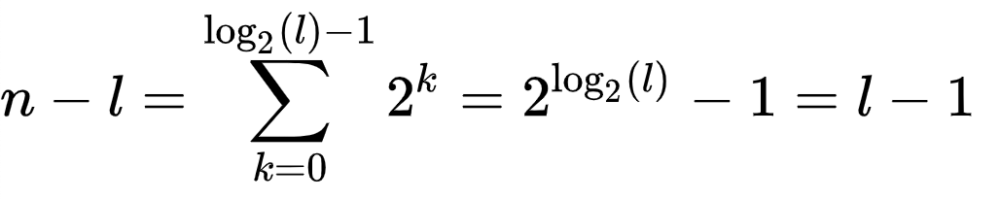

# Tree

###  Rooted Binary Tree
A rooted binary tree has a root node and every node has at most two children.

### Full Binary Tree
A full binary tree is a tree in which every node has either 0 or 2 children. 
Another way of defining a full binary tree is a recursive definition. A full binary tree is either:
* A single vertex.
* A tree whose root node has two subtrees, both of which are full binary trees.

The number of nodes {\displaystyle n}n in a full binary tree, is at least {\displaystyle n=2h+1}n=2h+1 and at most {\displaystyle n=2^{h+1}-1}{\displaystyle n=2^{h+1}-1}, where {\displaystyle h}h is the height of the tree. A tree consisting of only a root node has a height of *0*.

A full binary tree with {\displaystyle l}l leaves has {\displaystyle n=2l-1}n=2l-1 nodes.

### Complete Binary Tree
In a complete binary tree every level, except possibly the last, is completely filled, and all nodes in the last level are as far left as possible. 
It can have between 1 and 2^h nodes at the last level *h*. 

The number of internal nodes in a complete binary tree of n nodes is {\displaystyle \lfloor n/2\rfloor }\lfloor n/2\rfloor .

### Perfect Tree
A perfect binary tree is a binary tree in which all interior nodes have two children and all leaves have the same depth or same level.

The number of leaf nodes {\displaystyle l}l in a perfect binary tree, is {\displaystyle l=(n+1)/2}l=(n+1)/2 because the number of non-leaf (a.k.a. internal) nodes

In a perfect full binary tree, {\displaystyle l=2^{h}}l=2^{h} thus {\displaystyle n=2^{h+1}-1}n=2^{h+1}-1.

### Balanced Binary Tree
A balanced binary tree is a binary tree structure in which the left and right subtrees of every node differ in height by no more than 1.

# Reference
* Wikipedia, https://en.wikipedia.org/wiki/Binary_tree