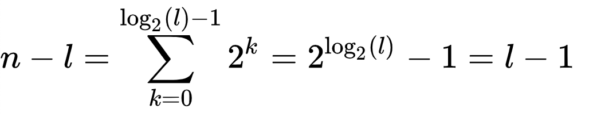

# Tree
## Table of Contents
- [Definitions](#definitions)
- [Problems](#problems)
    - [Create a binary tree](#create-a-binary-tree)
    - [Construct a complete binary tree in level order](#construct-a-complete-binary-tree-in-level-order)
    - [Insert a node in a binary tree](#insert-a-node-in-a-binary-tree)
    - [Delete a node from binary tree](#delete-a-node-from-binary-tree)
    - [Create a tree from in-order traversal and pre-order](#create-a-tree-from-in-order-traversal-and-pre-order)
    - [Create binary tree from linked list](#create-binary-tree-from-linked-list)
    - [Construct a binary tree from pre-order and post-order traversal](#construct-a-binary-tree-from-pre-order-and-post-order-traversal)
    - [Find maximum depth of a Binary tree](#find-maximum-depth-of-a-binary-tree)
    - [Verify if a Binary tree is balanced](#verify-if-a-binary-tree-is-balanced)
    

## Definitions
####  Rooted Binary Tree
A rooted binary tree has a root node and every node has at most two children.

#### Full Binary Tree
A full binary tree is a tree in which every node has either 0 or 2 children. 
Another way of defining a full binary tree is a recursive definition. A full binary tree is either:
* A single vertex.
* A tree whose root node has two subtrees, both of which are full binary trees.

The number of nodes *n* in a full binary tree, is at least  and at-most  where *h* is the height of the tree. 
A tree consisting of only a root node has a height of *0*.

A full binary tree with *l* leaves has  nodes.

#### Complete Binary Tree
In a complete binary tree every level, except possibly the last, is completely filled, and all nodes in the last level are as far left as possible. 
It can have between 1 and 2^h nodes at the last level *h*. 

The number of internal nodes in a complete binary tree of *n* nodes is .


#### Perfect Tree
A perfect binary tree is a binary tree in which all interior nodes have two children and all leaves have the same depth or same level.

The number of leaf nodes *l* in a perfect binary tree, is   because the number of non-leaf (a.k.a. internal) nodes


In a perfect full binary tree,  thus 

#### Balanced Binary Tree
A binary tree is balanced if the height of the tree is  where *n* is the number of nodes. 

#### Complete Binary Tree: 
A Binary Tree is complete Binary Tree if all levels are completely filled except possibly the last level and the last level has all keys as left as possibleA balanced binary tree is a binary tree structure in which the left and right subtrees of every node differ in height by no more than 1.

* The maximum number of nodes at level `L` of a binary tree is 
* Maximum number of nodes in a binary tree of height `H` is 

## Problems
### Create a binary tree
**Problem**:
Given an array of elements, sorted in ascending order, task is to construct a complete binary tree from this array using level order approach.

**Time Complexity**\
Each node will be traversed once, so the time complexity is `O(n)`

**Space Complexity**\
`O(n)`

[Implementation](create_binary_tree.py)

### Construct a complete binary tree in level order
**Problem**:
Given an array of elements, task is to construct a complete binary tree from this array in level order.

Example: 
```
Input: [1, 2, 3, 4, 5, 6, 7, 8, 9, 10]
Tree:              1
                /     \
               2       3
              / \     / \
             4   5   6   7
            / \  /
           8  9 10
In Order:
8 4 9 2 10 5 1 6 3 7
```
**Solution**:
We need a generic logic to pick left and right child of a parent node from array.
If parent is at index *i* then pick *2 x i + 1* as left child and *2 x i + 2* as right child. Repeatedly apply this logic until all the elements in the list are picked up.

**Time Complexity**\
`O(n)`

**Space Complexity**\
`O(n)`

[Implementation](create_binary_tree_in_level_order.py)

### Insert a node in a binary tree
**Problem**:\
Given a binary tree and a key, insert the key into the binary tree at first position available in level order.

**Solution**:

**Time Complexity**\

**Space Complexity**\

[Implementation](insertion_in_binary_tree.py)

### Delete a node from binary tree
**Problem**:\
Given a binary tree, delete a node from it by making sure that tree shrinks from the bottom.

**Solution**:

**Time Complexity**\

**Space Complexity**\

[Implementation](delete_node_in_binary_tree.py)

### Create a tree from in-order traversal and pre-order
**Problem**:\
Given list of elements by traversing a tree in-order and pre-order, task is to construct a tree from these two list.

**Solution**:

**Time Complexity**\

**Space Complexity**\

[Implementation](construct_tree_from_inorder_preorder_traversals.py)

### Create binary tree from linked list
**Problem**:\
Construct a complete binary tree from a linked list

**Solution**:

**Time Complexity**\

**Space Complexity**\

[Implementation](create_complete_binary_tree_from_linked_list.py)

### Construct a binary tree from pre-order and post-order traversal
**Problem**:\
Given two arrays that represent pre-order and post-order traversals of a full binary tree, task is to construct the binary tree.

**Solution**:
In pre-order traversal root node is visited first then left node then right node.
```
(root node) (left branch) (right branch)
```
While in post-order traversal left node is visited first then right node then root node. 
```
(left branch) (right branch) (root node)
````

Example:
```
Pre order: 1  2 4 5  3 6 7
Post order: 4 5 2  6 7 3  1
```
In Pre-order traversal the first element is the root of the tree, the element next to the first element in the pre-order traversal list is the left child of the root. So `1` will be root and `2` is left child.
So `2` is root of all nodes in left subtree. Then all the nodes before `2` in post-order traversal must be in left subtree, which are `[4, 5]`.
So `1` is root, elements `[4, 5, 2]` are in left subtree, and the elements `[6, 7, 3]` are in right subtree.
Recursively applying the same logic we will have the full tree.

```
            1
          /   \
   [2, 4, 5] [3, 6, 7]

 
             1
            / \
          2     3
         / \   / \ 
        4   5 6   7 
```

Let's say the left branch has *L* nodes. We know the head node of that left branch is `pre[1]`,
 but it also occurs last in the post-order representation of the left branch. So `pre-order[1] = post-order[L-1]`
 
Now in our recursion step, the left branch is represnted by `pre-order[1 : L+1]` and `post-order[0 : L]`, while the right branch is represented by `pre-order[L+1 : N]` and `post-order[L : N-1]`.

**Time Complexity:**
`O(n^2)`, where n is the number of nodes.

**Space Complexity:** 
`O(n^2)`

[Implementation](construct_full_binary_tree_from_post_pre_order.py)

### Find maximum depth of a Binary tree
**Problem**:\
Given a binary tree, the problem is to find maximum depth of the tree. 

Example:
```
Tree
         a
       /   \  
      b     c
       \   / \  
        e f   g
               \
                h
Depth:  4
```

**Solution**:
We can solve this problem by using both breath first or depth first traversal. We can try level-order search.
Here is the depth first approach with recursion. So at each node we get maximum depth of its left and right sub tree and add 1 to that.
The base case will be if the node is null then return 0. Other edge cases are like if right node of current is null then return depth 
of depth of left sub-tree. Similarly if left node of current node is null then return depth of right sub-tree.

**Time Complexity:**
Here, we are traversing each node once, so the time complexity is `O(n)`, where n is the number of nodes.

**Space Complexity:** 
`O(1)`

[Implementation](depth_of_binary_tree.py)

### Verify if a Binary tree is balanced
**Problem**:\
Given a binary tree, the problem is to find if the tree is balanced binary tree. 
Here by balanced means the height is balanced, so the difference between height of the left subtree and height of right subtree 
will be less than or equal to 1.

Example:
```
Balanced Binary Tree
         a
       /   \  
      b     c  height difference = 3 (left) - 3 (right) = 0
     / \   /  
    e   f f 

         a
       /   \  
      b     c  height difference = 3 (left) - 2 (right) = 1
     / \   
    e   f

Unbalanced Binary Tree

        a
       /    
      b      height difference = 3 (left) - 1 (right) = 2
     / \   
    e   f


         a
       /   \  
      b     c  height difference = 4 (left) - 2 (right) = 2
     / \   
    e   f
   /
  g  
```

**Solution**:\
We can split the problem like this, in a node if left subtree and right subtree
 is balanced and the height difference is less than or equal to 1 then the tree rooted at the node is 
 a balanced tree. We should do this recursively. 
 
**Time Complexity:**
As we are traversing each node exactly once the time complexity is `O(n)`.

**Space Complexity:** 
Constant space complexity, `O(1)`

[Implementation](balanced_binary_tree.py)

# Reference
* Wikipedia, https://en.wikipedia.org/wiki/Binary_tree