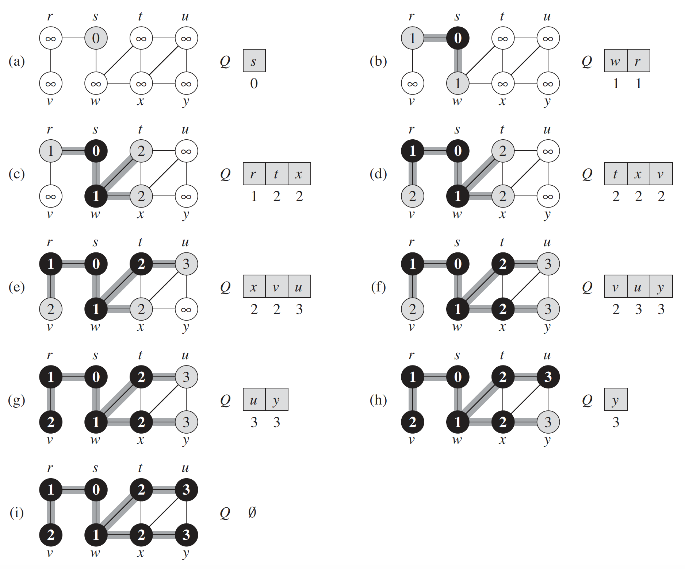
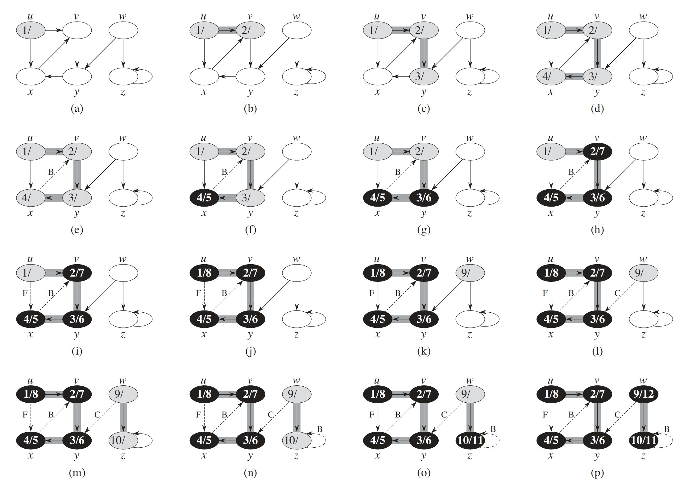

# Searching Algorithms
- [Breadth-first search](#breadth-first-search)
- [Depth-first search](#depth-first-search)
- [Binary Search](#binary-search)
- [Interpolation Search](#interpolation-search)
- [Exponential Search](#exponential-search)
- [Jump Search](#jump-search)

### Breadth-first search

Given a graph *G = (V,E)* and a distinguished source vertex *s*, breadth-first
search systematically explores the edges of *G* to “discover” every vertex that is
reachable from *s*.

Breadth-first search is so named because it expands the frontier between discovered
and undiscovered vertices uniformly across the breadth of the frontier. That
is, the algorithm discovers all vertices at distance *k* from s before discovering any
vertices at distance *k+1*.

To keep track of progress, breadth-first search colors each vertex *white*, *gray*, or
*black*. All vertices start out *white* and may later become *gray* and then *black*. A
vertex is discovered the first time it is encountered during the search, at which time
it becomes nonwhite. *Gray* and *black* vertices, therefore, have been discovered, but
breadth-first search distinguishes between them to ensure that the search proceeds
in a breadth-first manner. 

If *(u,v)* ∈ *E* and vertex *u* is *black*, then vertex *v* 
is either *gray* or *black*; that is, all vertices adjacent to *black* vertices have been
discovered. *Gray* vertices may have some adjacent *white* vertices; they represent
the frontier between discovered and undiscovered vertices

```
BFS(G, s)
1 for each vertex u ∈ G.V - {s}
2   u.color <- WHITE
3   u.d <- 1
4   u.π <- NIL
5 s.color <- GRAY
6 s.d <- 0
7 s.π <- NIL
8 Q = Ø
9 ENQUEUE(Q,s)
10 while Q ≠ Ø:
11   u <- DEQUEUE(Q)
12   for each v ∈ G.Adj[u]
13      if v.color == WHITE:
14          v.color = GRAY
15          v.d <- u.d + 1
16          v.π <- u
17          ENQUEUE(Q, v)
18   u.color <- BLACK
```

The operation of BFS on an undirected graph. Tree edges are shown shaded as they
are produced by BFS. The value of u.d appears within each vertex u. The queue Q is shown at the
beginning of each iteration of the while loop of lines 10–18. Vertex distances appear below vertices
in the queue.

**Time Complexity**\
Time complexity `O(n^2)`.

**Space Complexity**\
`O(n)`, *n* is number of nodes.

[Implementation 1](./breath_first_search.py)\
[Implementation 2](./bfs.py)

### Depth-first search
Depth-first search explores the deepest node in the graph. 
Depth-first search explores edges out of the most recently discovered 
vertex *v* that still has unexplored edges leaving it. Once all of *v*'s edges have been explored, the search "backtracks" to explore edges
leaving the vertex from which *v* was discovered. This process continues until we
have discovered all the vertices that are reachable from the original source vertex.
If any undiscovered vertices remain, then depth-first search selects one of them as
a new source, and it repeats the search from that source. The algorithm repeats this
entire process until it has discovered every vertex.

```
DFS(G)
1 for each vertex u ∈ G.V
2   u.color <- WHITE
3   u.π <- NIL
4 time <- 0
5 for each vertex u ∈ G.V
6   if u.color == WHITE
7       DFS-VISIT(G,u)

DFS-VISIT(G,u)
1 time <- time + 1 // white vertex u has just been discovered
2 u.d <- time
3 u.color <- GRAY
4 for each v ∈ G.Adj[u] // explore edge (u,v)
5   if v.color == WHITE
6       v.π <- u
7 DFS-VISIT(G,v)
8 u.color <- BLACK // blacken u; it is finished
9 time <- time + 1
10 u.f <- time
```


The progress of the depth-first-search algorithm DFS on a directed graph. As edges
are explored by the algorithm, they are shown as either shaded (if they are tree edges) or dashed
(otherwise). Nontree edges are labeled B, C, or F according to whether they are back, cross, or
forward edges. Timestamps within vertices indicate discovery time/finishing times.


### Binary Search
Binary search, also known as half-interval search, logarithmic search, is a search algorithm that finds the position of a target value within a sorted array. Binary search compares the target value to the middle element of the array.
If they are not equal, the half in which the target cannot lie is eliminated and the search continues on the remaining half, again taking the middle element to compare to the target value, and repeating this until the target value is found.\
Complexity of binary search is .  where *n* is the number of elements in the array.

**Problem:**
Given an array A of *n* numbers where  and target value T. The task is the find the position of *T* in the array.

**Solution:**
```
// Algorithm
1. Set low to 0 and high to n-1
2. if low > high then the search terminates as unsuccessfull.
3. Set mid as floor of (low + high)/2  
4. If A[mid] < T then set low = mid + 1 an go to step 2.
5. If A[mid] > T then set high = mid - 1 and go to step 2.
6. If A[mid] = T then match found, return mid
```

[Implementation](./binary_search.py)