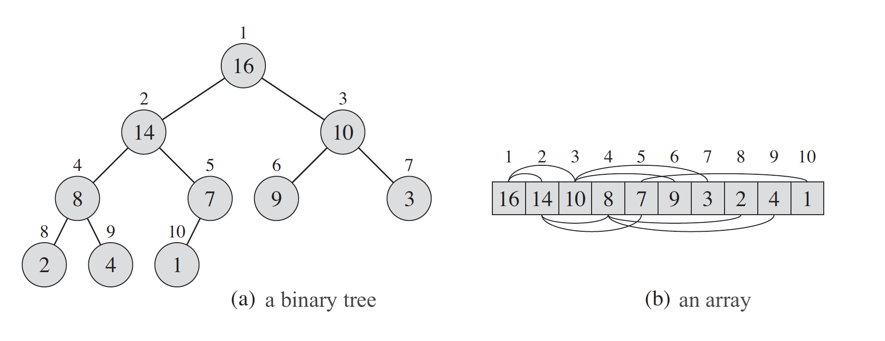
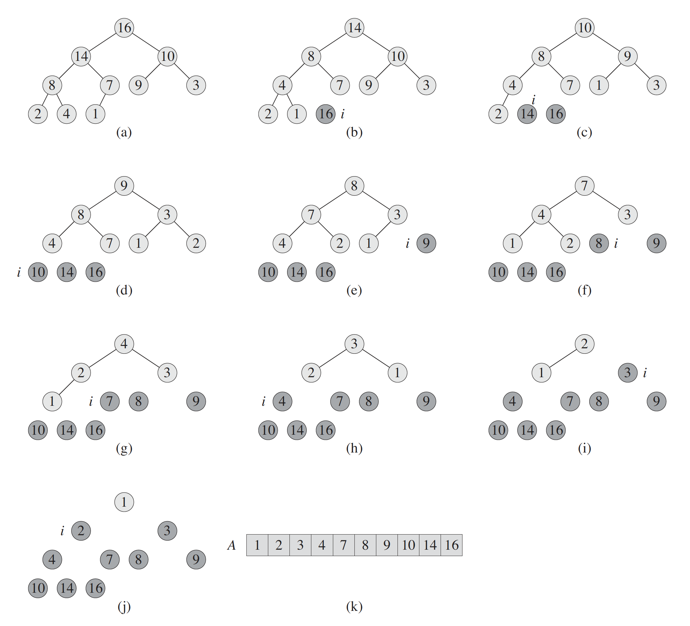

# Sorting Algorithms
- [Merge Sort](#merge-sort)
- [Quick Sort](#quick-sort)
- [Selection Sort](#selection-sort)
- [Heap Sort](#heap-sort)

### Merge Sort
Merge sort is an efficient, general-purpose, comparison-based sorting algorithm. Most implementations produce a stable sort, which means that 
the order of equal elements is the same in the input and output. Merge sort is a divide and conquer algorithm that was invented by *John von Neumann* in 1945.

Conceptually, a merge sort works as follows:
* Divide the unsorted list into *n* sublists, each containing one element (a list of one element is considered sorted).
* Repeatedly merge sublists to produce new sorted sublists until there is only one sublist remaining. This will be the sorted list.

**Pseudocode**
```
MERGE-SORT(A, p, r)
1 if p < r
2   then q ← ⌊(p + r)/2⌋
3 MERGE-SORT(A, p, q)
4 MERGE-SORT(A, q + 1, r)
5 MERGE(A, p, q, r) 


MERGE(A, p, q, r)
1  n1 ← q - p + 1
2  n2 ← r - q
3  create arrays L[1  n1 + 1] and R[1  n2 + 1]
4  for i ← 1 to n1
5      do L[i] ← A[p + i - 1]
6  for j ← 1 to n2
7      do R[j] ← A[q + j]
8  L[n1 + 1] ← ∞
9  R[n2 + 1] ← ∞
10 i ← 1
11 j ← 1
12 for k ← p to r
13     do if L[i] ≤ R[j]
14         then A[k] ← L[i]
15             i ← i + 1
16         else A[k] ← R[j]
17             j ← j + 1 
```
To perform the merging, we use an auxiliary procedure `MERGE(A, p, q, r)`, `A` is an array and `p`, `q`, and `r` are indices numbering \
 elements of the array such that `p ≤ q < r`. The procedure assumes that the sub-arrays `A[p  q]` and `A[q + 1  r]` are in sorted order. 
It merges them to form a single sorted subarray that replaces the current subarray `A[p  r]`

In detail, the `MERGE` procedure works as follows. Line 1 computes the length `n1` of the
subarray `A[p   q]`, and line 2 computes the length `n2` of the subarray `A[q + 1   r]`. We create
arrays `L` and `R` ("left" and "right"), of lengths `n1 + 1` and `n2 + 1`, respectively, in line 3. The for
loop of lines 4-5 copies the subarray `A[p   q]` into `L[1  n1]`, and the for loop of lines 6-7
copies the subarray `A[q + 1   r]` into `R[1   n2]`. Lines 8-9 put the sentinels at the ends of the
arrays `L` and `R`. Lines 10-17, illustrated in Figure, perform the `r - p + 1` basic steps by
maintaining the following loop invariant:
* At the start of each iteration of the for loop of lines 12-17, the subarray `A[p   k - 1]`
contains the `k - p` smallest elements of `L[1   n1 + 1]` and `R[1   n2 + 1]`, in sorted
order. Moreover, `L[i]` and `R[j]` are the smallest elements of their arrays that have not
been copied back into `A`.

**Time Complexity:** 
Best case: `n log n`, average: `n log n`, worse: `n log n`

### Quick Sort
Quicksort is a *divide-and-conquer* algorithm. It works by selecting a ***pivot*** element from the array and partitioning the other elements into two sub-arrays, 
according to whether they are less than or greater than the *pivot*. The sub-arrays are then sorted recursively. This can be done in-place, 
requiring small additional amounts of memory to perform the sorting.

The steps for in-place Quicksort are:

1. Pick an element, called a *pivot*, from the array.
2. *Partitioning:* reorder the array so that all elements with values less than the *pivot* come before the *pivot*, while all elements with values greater 
than the *pivot* come after it (equal values can go either way). After this partitioning, the *pivot* is in its final position. This is called the partition operation.
3. Recursively apply the above steps to the sub-array of elements with smaller values and separately to the sub-array of elements with greater values.

**Pseudocode**
```
QUICKSORT(A,low,high)
1  if low < high
2      then p ← PARTITION(A,low,high)
3           QUICKSORT(A,low,p-1)
4           QUICKSORT(A,p+1,high)

PARTITION(A,low,high)
1  pivot = A[high]
2  i = low
3  for j ← low to high
4      if A[j] < pivot
5           swap A[i] with A[j]
6           i++
7  swap A[i] with A[high]     
8  return i
```

**Time Complexity:** 
Best case: `n log n`, average: `n log n`, worse: `n^2`

**Space Complexity**
Quicksort is usually done in-place with `O(log n)` stack space

[Implementation - Python](./quick_sort.py)\
[Implementation - Java](../java/src/com/sorting/Quicksort/Quicksort.java)

### Selection Sort
Selection sort is an in-place comparison sorting algorithm. It has an `O(n^2)` time complexity, which makes it inefficient on large lists, and generally performs worse.
Selection sort is noted for its simplicity and has performance advantages over more complicated algorithms in certain situations, particularly where auxiliary memory is limited

The algorithm divides the input list into two parts.
1. A sorted sublist of items which is built up from left to right at the front (left) of the list 
2. A sublist of the remaining unsorted items that occupy the rest of the list.

In every iteration of selection sort, the minimum element (considering ascending order) from the unsorted subarray is picked and moved to the sorted subarray.

Example:
```
arr[] = 64 27 31 10 21 11

// Find the minimum element in arr[0...5]
// and place it at beginning
10 27 31 64 21 11

// Find the minimum element in arr[1...5]
// and place it at beginning of arr[1...5]
10 11 31 64 21 27

// Find the minimum element in arr[2...4]
// and place it at beginning of arr[2...4]
10 11 21 64 31 27

// Find the minimum element in arr[3...4]
// and place it at beginning of arr[3...4]
10 11 21 27 31 64

10 11 21 27 31 64 
```

Time Complexity: Time complexity is `n^2`. To find minimum in unsorted list it has to compare with other remaining numbers.

Space Complexity: The algorithm is in-place, don't need additional space.

[Implementation](./selection_sort.py)


### Heap Sort
*Heapsort* is a comparison-based sorting algorithm. *Heapsort* sorts in place. *Heapsort* can be thought of as an improved selection sort: like *selection sort*, *heapsort* divides its input into a sorted and an unsorted region, 
and it iteratively shrinks the unsorted region by extracting the largest element from it and inserting it into the sorted region. Unlike *selection sort*, *heapsort* does not waste time with a linear-time scan of 
the unsorted region; rather, heap sort maintains the unsorted region in a heap data structure to more quickly find the largest element in each step

The (binary) heap data structure is an array object that we can view as a nearly complete binary tree. Each
node of the tree corresponds to an element of the array. The tree is completely filled on all levels except possibly the lowest, which is filled from the
left up to a point. An array `A` that represents a heap is an object with two attributes: `A:length`, which (as usual) gives the number of elements in the array, and
`A:heap-size`, which represents how many elements in the heap are stored within
array `A`. That is, although `A[1...A.length]` may contain numbers, only the elements
in `A[1...A.heap-size]`, where `0 ≤ A:heap-size ≤ A:length`, are valid elements
of the heap. The root of the tree is *A[1]*, and given the index *i* of a node, we
can easily compute the indices of its parent, left child, and right child:



```
PARENT(i)
1 return ⌊i/2⌋

LEFT(i)
1 return 2i

RIGHT(i)
1 return 2i C 1
```

There are two kinds of binary heaps: ***max-heaps*** and ***min-heaps***. In both kinds,
the values in the nodes satisfy a heap property, the specifics of which depend on
the kind of heap. In a *max-heap*, the *max-heap* property is that for every node *i*
other than the root,
`A[PARENT(i)] ≥ A[i]`;\
that is, the value of a node is at most the value of its parent. Thus, the largest
element in a *max-heap* is stored at the root, and the subtree rooted at a node contains values no larger than that contained at the node itself. A min-heap is organized in
the opposite way; the min-heap property is that for every node i other than the
root,
`A[PARENT(i)] ≤ A[i]`\

Viewing a heap as a tree, we define the ***height*** of a node in a heap to be the number of edges on the longest simple downward path from the node to a leaf, and
we define the height of the heap to be the height of its root. Since a heap of *n* elements
is based on a complete binary tree, its height is *Θ(log n)*

**Algorithm:**
The Heapsort algorithm involves preparing the list by first turning it into a *max heap*. The algorithm then repeatedly swaps the first value of the list with the last value, 
decreasing the range of values considered in the heap operation by one, and sifting the new first value into its position in the heap. This repeats until the range of considered values is one value in length.

The steps are:
1. Build max-heap from input data. Also referred to as heapify(), this builds a heap from a list in O(n) operations. At this point, the largest item is stored at the root of the heap. 
2. Swap the first element of the list with the final element. Decrease the considered range of the list by one.
3. Shift the new first element to its appropriate index in the heap.
4. Go to step (2) unless the considered range of the list is one element.

Procedure `MAX-HEAPIFY` in a bottom-up manner to convert an array `A[1...n]`, where `n = A.length`, into a max-heap.
The procedure `BUILD-MAX-HEAP` goes through the remaining nodes of the tree and runs `MAX-HEAPIFY` on each one.
```
MAX-HEAPIFY(A,i)
1 l ← LEFT(i)  // 2i
2 r ← RIGHT(i)  // 2i + 1
3 if l ≤ A.heap-size and A[l] > A[i]
4     largest ← l
5 else 
6     largest ← i
6 if r ≤ A.heap-size and A[r] > A[largest]
7     largest ← r
8 if largest ≠ i
    9     exchange A[i] with A[largest]
10 MAX-HEAPIFY(A, largest)

BUILD-MAX-HEAP(A)
1 A.heap-size ← A:length
2 for i ← ⌊A.length/2⌋ downto 1
3   MAX-HEAPIFY(A,i)

``` 

The *heapsort* algorithm starts by using BUILD-MAX-HEAP to build a max-heap on the input array `A[1...n]`, where `n = A:length`. Since the maximum element
of the array is stored at the root A[1], we can put it into its correct final position by exchanging it with `A[n]`.

```
HEAPSORT(A)
1 BUILD-MAX-HEAP(A)
2 for i ← A.length downto 2
3    exchange A[1] with A[i]
4    A.heap-size ← A.heap-size - 1
5    MAX-HEAPIFY(A,1)
```

If we now discard node n from the heap—and we can do so by simply decrementing A.heap-size - we observe that the children of
the root remain max-heaps, but the new root element might violate the max-heap property. All we need to do to restore the max-heap property, however, is call
`MAX-HEAPIFY(A,1)`, which leaves a max-heap in `A[1....n]`. The heapsort algorithm then repeats this process for the max-heap of size `n-1` down to a heap
of size 2.


*The operation of HEAPSORT. (a) The max-heap data structure just after BUILD-MAXHEAP
has built it in line 1. (b)–(j) The max-heap just after each call of MAX-HEAPIFY in line 5,
showing the value of i at that time. Only lightly shaded nodes remain in the heap. (k) The resulting
sorted array A.*

**Time Complexity:** 
Best case: `n log n`, average: `n log n`, worse: `n^2`


[Implementation](./heap_sort.py)
